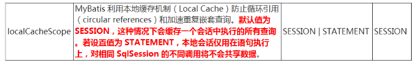
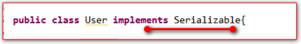

## 一、简介

- MyBatis 包含一个非常强大的查询缓存特性,它可以非常方便地配置和定制。缓存可以极大的提升查询效率。
- MyBatis系统中默认定义了两级缓存：① 一级缓存，② 二级缓存。
- 默认情况下，只有一级缓存（SqlSession级别的缓存，也称为本地缓存）开启。
- 二级缓存需要手动开启和配置，他是基于 namespace 级别的缓存。
- 为了提高扩展性。MyBatis 定义了缓存接口 Cache。我们可以通过实现 Cache 接口来自定义二级缓存

## 二、一级缓存

### 1、介绍

1. 一级缓存(local cache), 即本地缓存, 作用域默认为 sqlSession。当  Session flush 或 close 后, 该 Session 中的所有 Cache 将被清空。
2. 本地缓存不能被关闭, 但可以调用 clearCache() 来清空本地缓存, 或者改变缓存的作用域.
3. 在mybatis3.1之后, 可以配置本地缓存的作用域. 在 mybatis.xml 中配置
4. 一级缓存的工作机制：同一次会话期间只要查询过的数据都会保存在当前 SqlSession 的一个 Map 中 key: hashCode+ 查询的 SqlId+ 编写的 sql 查询语句+参数。




### 2、使用

**User 对象** ：

```java
public class User {
    private Integer id;
    private String lastName;
    private Integer sex;
}
```

**UserMapper 接口** 

```java
public interface UserMapper {
    //一级缓存
    public User queryUserById2(Integer id);
}
```

**UserMapper.xml 配置** ：

```java
<?xml version="1.0" encoding="UTF-8" ?>
<!DOCTYPE mapper
  PUBLIC "-//mybatis.org//DTD Mapper 3.0//EN"
  "http://mybatis.org/dtd/mybatis-3-mapper.dtd">
<mapper namespace="com.atguigu.mapper.UserMapper">
<!--    public User queryUserById2(Integer id);  -->
    <select id="queryUserById2" resultType="com.xuwei.pojo.User">
        select id,last_name lastName,sex from t_user where id = #{id}
    </select>
</mapper>
```

**测试代码** ：

```java
@Test
public void testQueryUserById() throws IOException {
    SqlSessionFactory sqlSessionFactory = new SqlSessionFactoryBuilder()
        .build(Resources.getResourceAsStream("mybatis-config.xml"));

    SqlSession session = sqlSessionFactory.openSession();

    try {
        UserMapper userMapper = session.getMapper(UserMapper.class);

        System.out.println( userMapper.queryUserById(1) );
        System.out.println( userMapper.queryUserById(1) );
        System.out.println( userMapper.queryUserById(1) );
        System.out.println( userMapper.queryUserById(1) );
        System.out.println( userMapper.queryUserById(1) );

    } finally {
        session.close();
    }
}
```

### 3、一级缓存失效的几种情况

1. **不在同一个 SqlSession 对象中。**
2. **执行语句的参数不同。缓存中也不存在数据。**
3. **执行增，删，改，语句，会清空掉缓存**
4. **手动清空缓存数据。**

## 三、二级缓存

### 1、介绍

1. 二级缓存(second level cache)，全局作用域缓存。
2. 二级缓存默认不开启，需要手动配置。
3. MyBatis 提供二级缓存的接口以及实现，缓存实现要求 POJO 实现 Serializable 接口。
4. 二级缓存在 SqlSession 关闭或提交之后才会生效。

### 2、开启二级缓存

1. 我们需要在mybatis的核心配置文件中配置setting选项

```xml
<!-- 开启二级缓存 -->
<setting name="cacheEnabled" value="true"/>
```

2. 在Mapper的配置文件中加入cache标签。

```xml
<cache></cache>
```

3. 并且需要被二级缓存的对象必须要实现java的序列化接口。



### 3、缓存的相关属性

1. 在select标签中，useCache属性表示是否使用二级缓存。默认是 false， true 表示使用二级缓存（每次查询完之后。也会把这个查询的数据，放到二级缓存中）

```xml
<select id="queryUserById" resultType="com.xuwei.pojo.User" useCache="true">
  select id,last_name lastName,sex from t_user where id = #{id}
</select>
```

2. 在 insert、delete、update 标签中，都有 flushCache 属性，这个属性决定着执行完增，删，改的语句之后要不要清空二级缓存。默认值都是 true。

```xml
<!--    public int updateUser(User user); -->
<update id="updateUser" parameterType="com.atguigu.pojo.User" flushCache="false">
    update t_user set last_name = #{lastName},sex=#{sex} where id = #{id}
</update>
```

3. sqlSession.clearCache()：只是用来清除一级缓存。

### 4、cache 标签的介绍和说明

默认的 <cache/> 标签的使用：

1. 映射语句文件中的所有 select 语句将会被缓存。
2. 映射语句文件中的所有 insert,update 和 delete 语句会刷新缓存。
3. 缓存会使用 Least Recently Used(LRU,最近最少使用的)算法来收回。
4. 根据时间表(比如 no Flush Interval,没有刷新间隔), 缓存不会以任何时间顺序 来刷新。
5. 缓存会存储列表集合或对象(无论查询方法返回什么)的 1024 个引用。
6. 缓存会被视为是 read/write (可读/可写)的缓存,意味着对象检索不是共享的,而 且可以安全地被调用者修改,而不干扰其他调用者或线程所做的潜在修改。

**cache 标签实例解析** 

```xml
<cache
       eviction="FIFO"
       flushInterval="60000"
       size="512"
       readOnly="true"/>
```

- eviction 属性表示缓存策略。

- - LRU – 最近最少使用的:移除最长时间不被使用的对象***\*(这是默认策略)\****。
    - FIFO – 先进先出:按对象进入缓存的顺序来移除它们。
    - SOFT – 软引用:移除基于垃圾回收器状态和软引用规则的对象。
    - WEAK – 弱引用:更积极地移除基于垃圾收集器状态和弱引用规则的对象。

- flushInterval 	属性表示间隔多长时间刷新一下缓冲区，清理一下溢出的数据。以毫秒为单位。
- size 				属性表示缓存中可以保存多少个对象。默认是1024。
- readOnly			属性表示是否只读。如果设置为true。表示缓存中只有一个对象。如果设置为false***\*（默认为false）\****每次取出来都会反序列化拷贝一份。
- type				属性表示自定义二级缓存对象。

## 四、缓存的使用顺序

1. 当我们执行一个查询语句的时候。mybatis会先去二级缓存中查询数据。如果二级缓存中没有。就到一级缓存中查找。
2. 如果二级缓存和一级缓存都没有。就发sql语句到数据库中去查询。
3. 查询出来之后马上把数据保存到一级缓存中。
4. 当 SqlSession 关闭的时候，会把一级缓存中的数据保存到二级缓存中。