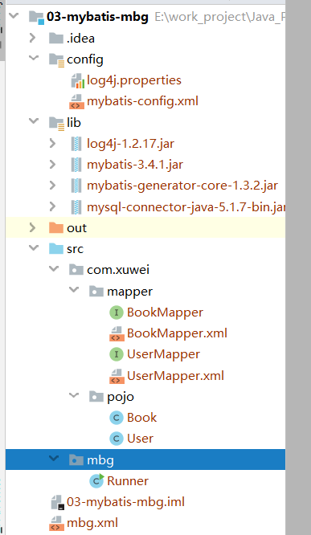

[TOC]

## 一、概述

MyBatis逆向工程，简称MBG。是一个专门为MyBatis框架使用者定制的代码生成器。可以快速的根据表生成对应的映射文件，接口，以及Bean类对象。

在Mybatis中，有一个可以自动对单表生成的增，删，改，查代码的插件。 叫 mybatis-generator-core-1.3.2。 

它可以帮我们对比数据库表之后，生成大量的这个基础代码。这些基础代码有：

1、数据库表对应的javaBean对象

2、这些javaBean对象对应的Mapper接口

3、这些Mapper接口对应的配置文件

## 二、项目开发

### 1、准备数据库表

```sql
create database mbg;

use mbg;

create table t_user(
    `id` int primary key auto_increment,
    `username` varchar(30) not null unique,
    `password` varchar(40) not null,
    `email` varchar(50)
);

insert into t_user(`username`,`password`,`email`) values('admin','admin','admin@atguigu.com');
insert into t_user(`username`,`password`,`email`) values('wzg168','123456','admin@atguigu.com');
insert into t_user(`username`,`password`,`email`) values('admin168','123456','admin@atguigu.com');
insert into t_user(`username`,`password`,`email`) values('lisi','123456','admin@atguigu.com');
insert into t_user(`username`,`password`,`email`) values('wangwu','123456','admin@atguigu.com');

create table t_book(
    `id` int primary key auto_increment,
    `name` varchar(50),
    `author` varchar(50),
    `price` decimal(11,2),
    `sales` int,
    `stock` int
);


## 插入初始化测试数据
insert into t_book(`id` , `name` , `author` , `price` , `sales` , `stock` ) 
values(null , 'java从入门到放弃' , '国哥' , 80 , 9999 , 9);

insert into t_book(`id` , `name` , `author` , `price` , `sales` , `stock` ) 
values(null , '数据结构与算法' , '严敏君' , 78.5 , 6 , 13);

insert into t_book(`id` , `name` , `author` , `price` , `sales` , `stock` ) 
values(null , '怎样拐跑别人的媳妇' , '龙伍' , 68, 99999 , 52);

insert into t_book(`id` , `name` , `author` , `price` , `sales` , `stock` ) 
values(null , '木虚肉盖饭' , '小胖' , 16, 1000 , 50);

insert into t_book(`id` , `name` , `author` , `price` , `sales` , `stock` ) 
values(null , 'C++编程思想' , '刚哥' , 45.5 , 14 , 95);

insert into t_book(`id` , `name` , `author` , `price` , `sales` , `stock` ) 
values(null , '蛋炒饭' , '周星星' , 9.9, 12 , 53);
 
insert into t_book(`id` , `name` , `author` , `price` , `sales` , `stock` ) 
values(null , '赌神' , '龙伍' , 66.5, 125 , 535);

select * from t_user;
select * from t_book;
```

### 2、创建一个 Java 工程



### 3、导入 jar 包

- log4j-1.2.17.jar
- mybatis-3.4.1.jar
- mybatis-generator-core-1.3.2.jar
- mysql-connector-java-5.1.7-bin.jar

### 4、准备配置文件

**mbg.xml 逆向工程的配置文件**：

```xml
<?xml version="1.0" encoding="UTF-8"?>
<!DOCTYPE generatorConfiguration
        PUBLIC "-//mybatis.org//DTD MyBatis Generator Configuration 1.0//EN"
        "http://mybatis.org/dtd/mybatis-generator-config_1_0.dtd">

<generatorConfiguration>
    <!--
        targetRuntime 表示你要生成的版本
            MyBatis3                豪华版本
            MyBatis3Simple          CRUD标准版
     -->
    <context id="DB2Tables" targetRuntime="MyBatis3Simple">

        <!-- 去掉全部的注释 -->
        <commentGenerator>
            <property name="suppressAllComments" value="true" />
        </commentGenerator>


        <jdbcConnection driverClass="com.mysql.jdbc.Driver"
                        connectionURL="jdbc:mysql://localhost:3306/mbg"
                        userId="root"
                        password="123456">
        </jdbcConnection>


        <javaTypeResolver >
            <property name="forceBigDecimals" value="false" />
        </javaTypeResolver>

        <!-- javaModelGenerator配置生成模型JavaBean
                targetPackage生成的javaBean的包名
                targetProject生成之后在哪个工程目录下
         -->
        <javaModelGenerator targetPackage="com.xuwei.pojo" targetProject=".\src">
            <property name="enableSubPackages" value="true" />
            <property name="trimStrings" value="true" />
        </javaModelGenerator>

        <!--
            sqlMapGenerator生成sql的mapper.xml配置文件
                targetPackage生成mapper.xml配置文件放的包名
         -->
        <sqlMapGenerator targetPackage="com.xuwei.mapper"  targetProject=".\src">
            <property name="enableSubPackages" value="true" />
        </sqlMapGenerator>

        <!--
            javaClientGenerator配置生成的Mapper接口

         -->
        <javaClientGenerator type="XMLMAPPER" targetPackage="com.xuwei.mapper"  targetProject=".\src">
            <property name="enableSubPackages" value="true" />
        </javaClientGenerator>

        <!-- 一个table标签，表示一个表 -->
        <table tableName="t_user" domainObjectName="User" ></table>
        <table tableName="t_book" domainObjectName="Book" ></table>


    </context>
</generatorConfiguration>
```

**log4j.properties** ：

```
# Global logging configuration
log4j.rootLogger=DEBUG, stdout
# Console output...
log4j.appender.stdout=org.apache.log4j.ConsoleAppender
log4j.appender.stdout.layout=org.apache.log4j.PatternLayout
log4j.appender.stdout.layout.ConversionPattern=%5p [%t] - %m%n
```

**mybatis-config.xml** :

```xml
<?xml version="1.0" encoding="UTF-8" ?>
<!DOCTYPE configuration
        PUBLIC "-//mybatis.org//DTD Config 3.0//EN"
        "http://mybatis.org/dtd/mybatis-3-config.dtd">
<configuration>

    <settings>
        <!-- 打开延迟加载的开关 -->
        <setting name="lazyLoadingEnabled" value="true" />
        <!-- 将积极加载改为消极加载 按需加载 -->
        <setting name="aggressiveLazyLoading" value="false" />
        <!-- 开启二级缓存 -->
        <setting name="cacheEnabled" value="true"/>
    </settings>

    <environments default="development">
        <environment id="development">
            <transactionManager type="JDBC" />
            <dataSource type="POOLED">
                <property name="driver" value="com.mysql.jdbc.Driver" />
                <property name="url" value="jdbc:mysql://localhost:3306/mbg" />
                <property name="username" value="root" />
                <property name="password" value="123456" />
            </dataSource>
        </environment>
    </environments>
    <mappers>
        <!-- 通过指定包的方式扫描接口和mapper.xml配置文件 -->
        <package name="com.xuwei.mapper" />
    </mappers>
</configuration>
```

**生成 mybatis 的代码** （每次生成都要先把原来的给删了）

```java
import org.mybatis.generator.api.MyBatisGenerator;
import org.mybatis.generator.config.Configuration;
import org.mybatis.generator.config.xml.ConfigurationParser;
import org.mybatis.generator.internal.DefaultShellCallback;

import java.io.File;
import java.util.ArrayList;
import java.util.List;

public class Runner {
    public static void main(String[] args) throws Exception {
        List<String> warnings = new ArrayList<String>();
        boolean overwrite = true;
        File configFile = new File("mbg.xml");
        ConfigurationParser cp = new ConfigurationParser(warnings);
        Configuration config = cp.parseConfiguration(configFile);
        DefaultShellCallback callback = new DefaultShellCallback(overwrite);
        MyBatisGenerator myBatisGenerator = new MyBatisGenerator(config,
                callback, warnings);
        myBatisGenerator.generate(null);
    }
}
```

**测试代码** 

```java
@Test
public void selectByPrimaryKey() {
    SqlSession session = sqlSessionFactory.openSession();
    try {
        BookMapper mapper = session.getMapper(BookMapper.class);
        System.out.println(mapper.selectByPrimaryKey(1));
    }finally {
        session.close();
    }
}
```