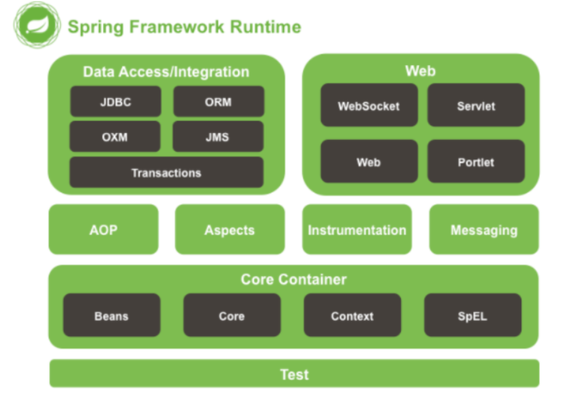
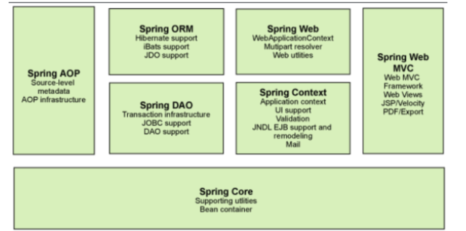
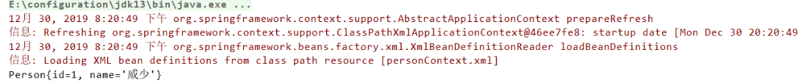

## 一、Spring 概述

**什么是框架 ？**

- 框架框架，框就是用什么框住，说明这个框架呢具有约束性(就是某一种标准)；架就是用什么东西撑住，具有支撑性。框架简而言之就是我们编写代码时要遵循某一标准且在某一具体东西上进行二次开发的半成品项目。
- 相当于简历的模板一样，可以直接拿过来用，并添加新的东西。

**Spring 是什么?**

- Spring 是一个轻量级的基于 IOC（Inverse of Control：控制反转）和 AOP（Aspect Oriented Programming：面向切面编程）的容器框架，并且它是开源的，为了简化企业级开发而生。通过 Spring，可以使 JavaEE 开发更容易使用，并且通过使基于 POJO 的编程模型，促进良好的编程习惯。

**Spring 的起源**

- 2002 年，Rod Jahnson首次推出了Spring框架雏形 interface21 框架。
- 2004年3月24日，Spring框架以interface21框架为基础，经过重新设计，发布了1.0正式版。
- Spring理念 : 使现有技术更加实用 . 本身就是一个大杂烩 , 整合现有的框架技术.

**Spring 的优良特性**

- 轻量：Spring 是轻量的，基本的版本大约 2MB。
- 控制反转：Spring 通过控制反转实现了松散耦合，对象们给出它们的依赖，而不是创建或查找依赖的对象们。
- 面向切面的编程(AOP)：Spring 支持面向切面的编程，并且把应用业务逻辑和系统服务分开。
- 容器：Spring 包含并管理应用中对象的生命周期和配置。
- MVC 框架：Spring 的 WEB 框架是个精心设计的框架，是 Web 框架的一个很好的替代品。
- 事务管理：Spring 提供一个持续的事务管理接口，可以扩展到上至本地事务下至全局事务（JTA）。
- 异 常 处 理 ： Spring 提 供 方 便 的 API 把 具 体 技 术 相 关 的 异 常 （ 比 如 由 JDBC ，Hibernate or JDO 抛出的）转化为一致的 unchecked 异常。

**Spring 模块的组成**



Spring 框架是一个分层架构，由 7 个定义良好的模块组成。Spring 模块构建在核心容器之上，核心容器定义了创建、配置和管理 bean 的方式。

****

1. Spring Core：核心容器， 提供 Spring 框架的基本功能 。其基本组件为 BeanFactory。Spring 框架建立在此模块之上，它使 Spring 成为一 个容器。
2. Spring Context：Spring 上下文是一个配置文件， 向 Spring 框架提供上下文信息。 
3. Spring AOP： Spring AOP 模块直接将面向切面的编程功能 , 集成到了 Spring 框架中。所以，可以很容易地使 Spring 框架管理任何支持 AOP 的对象 ，Spring AOP 模块为基于 Spring 的应用程序中的对象提供了事务管理服务。通过使用 Spring AOP，不用依赖组件，就可以将声明性事务管理集成到应用程序中。
4. Spring DAO：通过使用 JDBC 抽象和 DAO 模块，保证数据库代码的简洁，并能避免数据库资源错误关闭导致的问题，它在各种不同的数据库的错误信息之上，提供了一个统一的异常访问层。它还利用 Spring 的 AOP 模块给 Spring 应用中的对象提供事务管理服务。 
5. Spring ORM：Spring 通过提供 ORM 模块，支持我们在直接 JDBC 之上使用一个对象/关系映射映射(ORM)工具，Spring 支持集成主流的 ORM 框架，如 Hiberate,JDO 和 iBATISSQL Maps。Spring 的事务管理同样支持以上所有 ORM 框架及 JDBC。 
6. Spring Web 模块：Spring Web 模块：Spring 的 WEB 模块是构建在 application context 模块基础之上，提供一个适合 web 应用的上下文。这个模块也包括支持多种面向 web 的任务，如透明地处理多个文件上传请求和程序级请求参数的绑定到你的业务对象。它也有对 Jakarta Struts 的支持。 
7. Spring MVC 框架：MVC 框架是一个全功能的构建 Web 应用程序的 MVC 实现。通过策略接口，MVC 框架变成为高度可配置的，MVC 容纳了大量视图技术，其中包括 JSP、Velocity、Tiles、iText 和 POI。 

## 二、Spring 快速入门小案例

### 1、创建 Maven 工程

### 2、导入相应的 jar 包

```xml
<dependencies>
  <dependency>
    <groupId>org.springframework</groupId>
    <artifactId>spring-webmvc</artifactId>
    <version>5.0.5.RELEASE</version>
  </dependency>
</dependencies>
```

### 3、创建一个简单的 Person 类

```java
@Data
public class Person {
    private Integer id;
    private String name;
}
```

### 4、创建 personContext.xml 配置文件

bean 标签：

- - 作用：用于配置对象让 Spring 来创建，默认调用的是类的无参构造函数。
    - 属性：

- - - id：给对象在容器中提供一个唯一标识，用于获取对象。
             \- class：指定类的全限定类名，用于反射创建对象。
             \- scope：指定对象的作用范围。

- - - - singleton：默认为单例的
            - prototype：多例的

```xml
<?xml version="1.0" encoding="UTF-8"?>
<beans xmlns="http://www.springframework.org/schema/beans"
       xmlns:xsi="http://www.w3.org/2001/XMLSchema-instance"
       xsi:schemaLocation="http://www.springframework.org/schema/beans
                           http://www.springframework.org/schema/beans/spring-beans.xsd">

  <bean id="personOne" class="com.xuwei.pojo.Person">
    <property name="id" value="1"/>
    <property name="name" value="威少"/>
  </bean>

</beans>
```

### 5、测试

```java
public static void main(String[] args) {
    //1.使用 Application 接口，初始化容器
    ApplicationContext ac = new ClassPathXmlApplicationContext("personContext.xml");
    //2.通过 getBean() 获取对象
    Person person = (Person) ac.getBean("personOne");
    System.out.println(person);
}
```

### 6、查看结果



### 7、思考

- Person 对象是由谁创建的？【person 是由 Spring 框架创建的】
- Person 对象的属性是怎么设置的？【Person 对象的属性是由 Spring 容器设置的，这个过程就叫**控制反转**】
- **控制**：谁来控制对象的创建，传统应用程序的对象是由程序本身控制创建的，使用 Spring 后，对象是由 Spring 来创建的。
- **反转**：程序本身不创建对象，而变成被动的接受对象。
- 依赖注入：就是利用 set 方法来进行注入的。

举个例子来说明下：我们是如何找女朋友的呢？常见的方法是，我们到处去看哪里有长得漂亮身材又好的mm，然后打听她们的兴趣爱好、qq号、电话号、………，想办法认识她们，投其所好送其所要，然后进行下一步操作……这个过程是复杂深奥的，我们必须自己设计和面对每个环节。传统的程序开发也是如此，在一个对象中，如果要使用另外的对象，就必须得到它（自己new一个，或者从JNDI中查询一个），使用完之后还要将对象销毁（比如 Connection等），对象始终会和其他的接口或类耦合起来。

那么 IoC 是如何做的呢？有点像通过婚介找女朋友，在我和女朋友之间引入了一个第三者：婚姻介绍所。婚介管理了很多男男女女的资料，我可以向婚介提出一个列表，告诉它我想找个什么样的女朋友，比如长得像李嘉欣，身材像林熙雷，唱歌像周杰伦，速度像卡洛斯，技术像齐达内之类的，然后婚介就会按照我们的要求，提供一个mm，我们只需要去和她谈恋爱、结婚就行了。简单明了，如果婚介给我们的人选不符合要求，我们就会抛出异常。整个过程不再由我自己控制，而是有婚介这样一个类似容器的机构来控制。Spring所倡导的开发方式就是如此，所有的类都会在spring容器中登记，告诉spring你是个什么东西，你需要什么东西，然后spring会在系统运行到适当的时候，把你要的东西主动给你，同时也把你交给其他需要你的东西。所有的类的创建、销毁都由 spring来控制，也就是说控制对象生存周期的不再是引用它的对象，而是spring。对于某个具体的对象而言，以前是它控制其他对象，现在是所有对象都被spring控制，所以这叫控制反转。

