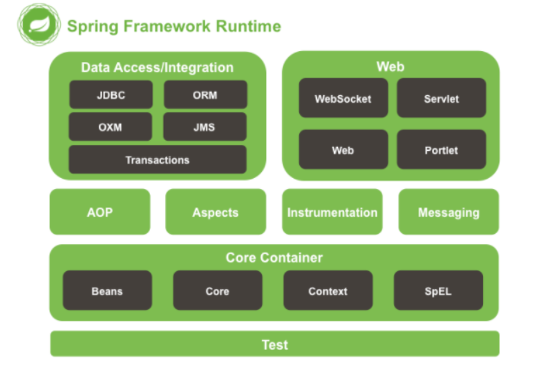
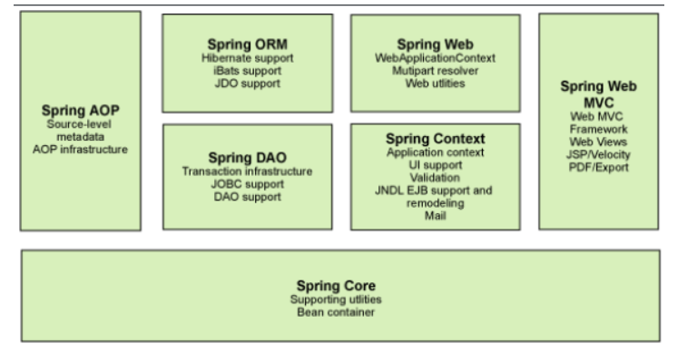
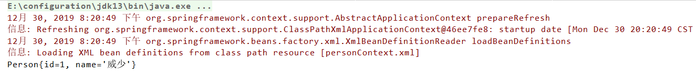

- # Spring 学习(一) 一一 概述

    ## 1. 引言

    允许自己说一些废话，不能继续做个废物，以前是真的喜欢抄课件知识点放到自己的博客上，弄的好像自己都会一样，傻逼，以后自己写，有多烂我认了。如果有兄弟姐妹看到，麻烦点评下，谢谢。

    

    

    

    ## 2. Spring 简述

    #### 什么是框架 ？

    - 框架框架，框就是用什么框住，说明这个框架呢具有约束性(就是某一种标准)；架就是用什么东西撑住，具有支撑性。框架简而言之就是我们编写代码时要遵循某一标准且在某一具体东西上进行二次开发的半成品项目。
    - 相当于简历的模板一样，可以直接拿过来用，并添加新的东西。

    

    #### Spring 是什么? 

    - Spring 是一个轻量级的基于 **IOC（Inverse of Control：控制反转）** 和 **AOP（Aspect Oriented Programming：面向切面编程）**的容器框架，并且它是开源的，为了简化企业级开发而生。通过 Spring，可以使 JavaEE 开发更容易使用，并且通过使基于 POJO 的编程模型，促进良好的编程习惯。

    

    **Spring 的起源**

    - 2002 年，Rod Jahnson首次推出了Spring框架雏形 interface21 框架。
    - 2004年3月24日，Spring框架以interface21框架为基础，经过重新设计，发布了1.0正式版。
    - Spring理念 : 使现有技术更加实用 . 本身就是一个大杂烩 , 整合现有的框架技术.

    

    #### Spring 的优良特性

    - **非侵入式**：基 于Spring 开发的应用中的对象可以不依赖于 Spring 的 API。
    - **依****赖注入**：DI——Dependency Injection，控制反转 (IOC) 最经典的实现。
    - **面向切面编程**：Aspect Oriented Programming——AOP

    

    #### Spring 模块的组成

    **
    **

    ****

    **
    **

    - Spring 框架是一个分层架构，由 7 个定义良好的模块组成。Spring 模块构建在核心容器之上，核心容器定义了创建、配置和管理 bean 的方式。

    

    ****

    - 组成 Spring 框架的每个模块（或组件）都可以单独存在，或者与其他一个或多个模块联合实现。每个模块的功能如下：

    - - **核心容器** ：核心容器提供 Spring 框架的基本功能。核心容器的主要组件是 `BeanFactory` ，它是实现工厂模式的实现。`BeanFactory` 使用*控制反转*（IOC） 模式将应用程序的配置和依赖性规范与实际的应用程序代码分开。
        - **Spring 上下文** ：Spring 上下文是一个配置文件，向 Spring 框架提供上下文信息。
        - **Spring AOP**：通过配置管理特性，Spring AOP 模块直接将面向切面的编程功能 , 集成到了 Spring 框架中。所以，可以很容易地使 Spring 框架管理任何支持 AOP的对象。Spring AOP 模块为基于 Spring 的应用程序中的对象提供了事务管理服务。通过使用 Spring AOP，不用依赖组件，就可以将声明性事务管理集成到应用程序中。
        - **Spring DAO**：JDBC DAO 抽象层提供了有意义的异常层次结构，可用该结构来管理异常处理和不同数据库供应商抛出的错误消息。异常层次结构简化了错误处理，并且极大地降低了需要编写的异常代码数量（例如打开和关闭连接）。Spring DAO 的面向 JDBC 的异常遵从通用的 DAO 异常层次结构。
        - **Spring ORM**：Spring 框架插入了若干个 ORM 框架，从而提供了 ORM 的对象关系工具，其中包括 JDO、Hibernate 和 iBatis SQL Map。所有这些都遵从 Spring 的通用事务和 DAO 异常层次结构。
        - **Spring Web 模块**：Web 上下文模块建立在应用程序上下文模块之上，为基于 Web 的应用程序提供了上下文。所以，Spring 框架支持与 Jakarta Struts 的集成。Web 模块还简化了处理多部分请求以及将请求参数绑定到域对象的工作。
        - **Spring MVC 框架**：MVC 框架是一个全功能的构建 Web 应用程序的 MVC 实现。通过策略接口，MVC 框架变成为高度可配置的，MVC 容纳了大量视图技术，其中包括 JSP、Velocity、Tiles、iText 和 POI。

    

    #### Spring 快速入门小案例 

    1. 创建 Maven 工程
    2. 导入相应的 jar 包

    

    ```
    <dependencies>
      <dependency>
        <groupId>org.springframework</groupId>
        <artifactId>spring-webmvc</artifactId>
        <version>5.0.5.RELEASE</version>
      </dependency>
    </dependencies>
    ```

    

    1. 创建一个简单的 Person 类

    

    ```
    public class Person {
        private Integer id;
        private String name;
    
        public Person() {
        }
    
        public Person(Integer id) {
            this.id = id;
        }
    
        public Integer getId() {
            return id;
        }
    
        public void setId(Integer id) {
            this.id = id;
        }
    
        public String getName() {
            return name;
        }
    
        public void setName(String name) {
            this.name = name;
        }
    
        @Override
        public String toString() {
            return "Person{" +
                "id=" + id +
                ", name='" + name + '\'' +
                '}';
        }
    }
    ```

    

    1. 创建 personContext.xml 配置文件

    bean 标签：

    - - 作用：用于配置对象让 Spring 来创建，默认调用的是类的无参构造函数。
        - 属性：

    - - - id：给对象在容器中提供一个唯一标识，用于获取对象。
            - class：指定类的全限定类名，用于反射创建对象。
            - scope：指定对象的作用范围。

    - - - - singleton：默认为单例的
                - prototype：多例的

    

    ```
    <?xml version="1.0" encoding="UTF-8"?>
    <beans xmlns="http://www.springframework.org/schema/beans"
           xmlns:xsi="http://www.w3.org/2001/XMLSchema-instance"
           xsi:schemaLocation="http://www.springframework.org/schema/beans
                               http://www.springframework.org/schema/beans/spring-beans.xsd">
    
      <bean id="personOne" class="com.xuwei.pojo.Person">
        <property name="id" value="1"/>
        <property name="name" value="威少"/>
      </bean>
    
    </beans>
    ```

    

    1. 测试

    

    ```
    public static void main(String[] args) {
        //1.使用 Application 接口，初始化容器
        ApplicationContext ac = new ClassPathXmlApplicationContext("personContext.xml");
        //2.通过 getBean() 获取对象
        Person person = (Person) ac.getBean("personOne");
        System.out.println(person);
    }
    ```

    

    1. 查看结果

    

    

    

    #### 思考 

    - Person 对象是由谁创建的？【person 是由 Spring 框架创建的】
    - Person 对象的属性是怎么设置的？【Person 对象的属性是由 Spring 容器设置的，这个过程就叫**控制反转**】
    - **控制**：谁来控制对象的创建，传统应用程序的对象是由程序本身控制创建的，使用 Spring 后，对象是由 Spring 来创建的。
    - **反转**：程序本身不创建对象，而变成被动的接受对象。
    - 依赖注入：就是利用 set 方法来进行注入的。

    

    **举个例子来说明下：****我们是如何找女朋友的呢？****常见的方法是，我们到处去看哪里有长得漂亮身材又好的mm，然后打听她们的兴趣爱好、qq号、电话号、………，想办法认识她们，投其所好送其所要，然后进行下一步操作……这个过程是复杂深奥的，我们必须自己设计和面对每个环节。传统的程序开发也是如此，在一个对象中，如果要使用另外的对象，就必须得到它（自己new一个，或者从JNDI中查询一个），使用完之后还要将对象销毁（比如 Connection等），对象始终会和其他的接口或类耦合起来。**

    **
    **

    **那么 IoC 是如何做的呢？有点像通过婚介找女朋友，在我和女朋友之间引入了一个第三者：婚姻介绍所。婚介管理了很多男男女女的资料，我可以向婚介提出一个列表，告诉它我想找个什么样的女朋友，比如长得像李嘉欣，身材像林熙雷，唱歌像周杰伦，速度像卡洛斯，技术像齐达内之类的，然后婚介就会按照我们的要求，提供一个mm，我们只需要去和她谈恋爱、结婚就行了。简单明了，如果婚介给我们的人选不符合要求，我们就会抛出异常。整个过程不再由我自己控制，而是有婚介这样一个类似容器的机构来控制。Spring所倡导的开发方式就是如此，所有的类都会在spring容器中登记，告诉spring你是个什么东西，你需要什么东西，然后spring会在系统运行到适当的时候，把你要的东西主动给你，同时也把你交给其他需要你的东西。所有的类的创建、销毁都由 spring来控制，也就是说控制对象生存周期的不再是引用它的对象，而是spring。对于某个具体的对象而言，以前是它控制其他对象，现在是所有对象都被spring控制，所以这叫控制反转。**

    

    

    

    ## 3. Spring 基于 XML 的 IOC 细节

    #### Spring 中工厂的类结构图

    

    

    

    

    #### BeanFactory 和 ApplicationContext 的区别

    - BeanFactory 是 Spring 容器中最顶层的接口，提供了最简单的容器的功能，只提供了实例化对象和拿对象的功能，在启动的时候不会去实例化 Bean，只有从容器中拿 Bean 的时候才会去实例化。
    - **ApplicationContext 是 BeanFactory 的子接口，是 Spring 中更高级的容器，功能很多，比如 AOP 等，****ApplicationContext** 在启动的时候就把所有的 Bean 全部实例化了，它还可以为 Bean 配置 lazy-init=true 来让Bean延迟实例化。

    

    #### ApplicationContext 接口的实现类

    - ClassPathXmlApplicationContext：它是从类的根路径下加载配置文件，推荐使用。
    - FileSystemXmlApplicationContext： 它是从磁盘路径上加载配置文件，配置文件可以在磁盘的任意位置，且在初始化时就创建单例的bean，也可以通过配置的方式指定创建的Bean是多实例的。
    - AnnotationConfigApplicationContext: 当我们使用注解配置容器对象时，需要使用此类来创建 spring 容器。它用来读取注解。 