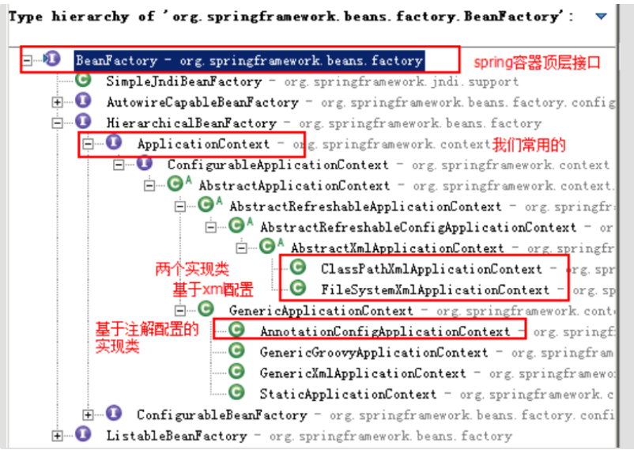

# Spring 学习(二) 一一 IOC 容器

## 1. IOC 概述

在应用程序中的组件需要获取资源时，传统的方式是组件主动的从容器中获取所需要的资源，在这样的模式下开发人员往往需要知道在具体容器中特定资源的获取方式，增加了学习成本，同时降低了开发效率。

反转控制的思想完全颠覆了应用程序组件获取资源的传统方式：反转了资源的获取方向——改由容器主动的将资源推送给需要的组件，开发人员不需要知道容器是如何创建资源对象的，只需要提供接收资源的方式即可，极大的降低了学习成本，提高了开发的效率。这种行为也称为查找的被动形式。

**传统方式:**  **我想吃饭**   **我需要买菜做饭**

**反转控制:**  **我想吃饭**   **饭来张口** 

**
**

**
**

**
**

## 2. Spring 基于 XML 的 IOC 细节

### Spring 中工厂的类结构图

### BeanFactory 和 ApplicationContext 的区别

- BeanFactory 是 Spring 容器中最顶层的接口，提供了最简单的容器的功能，只提供了实例化对象和拿对象的功能，在启动的时候不会去实例化 Bean，只有从容器中拿 Bean 的时候才会去实例化。
- **ApplicationContext 是 BeanFactory 的子接口，是 Spring 中更高级的容器，功能很多，比如 AOP 等，****ApplicationContext** 在启动的时候就把所有的 Bean 全部实例化了，它还可以为 Bean 配置 lazy-init=true 来让Bean延迟实例化。

### ApplicationContext 接口的实现类

- ClassPathXmlApplicationContext：它是从类的根路径下加载配置文件，推荐使用。
- FileSystemXmlApplicationContext： 它是从磁盘路径上加载配置文件，配置文件可以在磁盘的任意位置，且在初始化时就创建单例的bean，也可以通过配置的方式指定创建的Bean是多实例的。
- AnnotationConfigApplicationContext: 当我们使用注解配置容器对象时，需要使用此类来创建 spring 容器。它用来读取注解。 