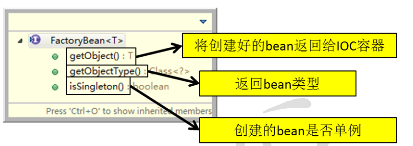
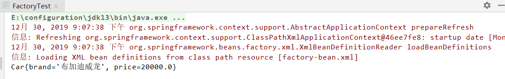
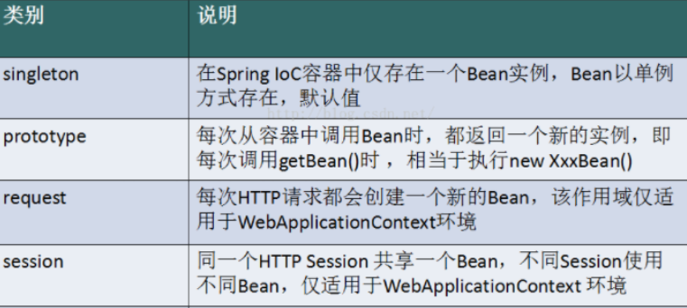
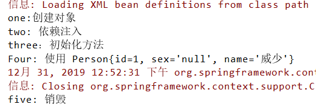

# Spring 学习(三) 一一  Bean 的配置

## 1. 实例化 Bean 的三种方式

### 1. 通过全类名(反射)

**从 IOC 容器中获取 bean 时，除了通过 id 值来获取，还可以通过 bean 的类型来获取，但是****如果同一个类型的 bean 在 XML 配置文件中配置了多个，则获取时会抛出异常，所以同一个类型的 bean 在容器中必须是唯一的。**


```
//使用此方法获取对象时，要求spring所管理的此类型对象只能有1个
Person person = ac.getBean(Person.class);
```

**
**

建议使用另一个重载的方法，同时指定 bean 和 id 值和类型。


```
Person person = ac.getBean("personTwo", Person.class);
```


```
<bean id="personTwo" class="com.xuwei.spring.mod.Person">
  <property name="id" value="2"></property>
  <property name="name" value="xuwei2"></property>
</bean>
```


### 2. 通过工厂方法获取

- **静态工厂方法：**直接调用某一个类的静态方法就可以返回 Bean 的实例。
- **实例工厂方法**：既需要创建工厂本身，还调用工厂的实例方法返回 bean 的实例


### 3. 通过 FactoryBean 来获取

Spring中有两种类型的 bean，一种是普通 bean，另一种是工厂bean，即 FactoryBean。工厂 bean 跟普通 bean 不同，其返回的对象不是指定类的一个实例，其返回的是该工厂 bean 的 getObject 方法所返回的对象。工厂 bean 必须实现 org.springframework.beans.factory.FactoryBean 接口。


​      


```
public class Car {
    private String brand;
    private Double price;

    public Car() {
    }

    public String getBrand() {
        return brand;
    }

    public void setBrand(String brand) {
        this.brand = brand;
    }

    public Double getPrice() {
        return price;
    }

    public void setPrice(Double price) {
        this.price = price;
    }

    @Override
    public String toString() {
        return "Car{" +
            "brand='" + brand + '\'' +
            ", price=" + price +
            '}';
    }
}
```


```
public class MyFactory implements FactoryBean {
    //将创建好的 Bean 返回给 IOC 容器
    public Object getObject() throws Exception {
        Car car = new Car();
        car.setBrand("布加迪威龙");
        car.setPrice(20000.0);
        return car;
    }
    //返回 bean 的类型
    public Class<?> getObjectType() {
        return Car.class;
    }
    //创建的 bean 是否单例
    public boolean isSingleton() {
        return false;
    }
}
```


```
<?xml version="1.0" encoding="UTF-8"?>
<beans xmlns="http://www.springframework.org/schema/beans"
    xmlns:xsi="http://www.w3.org/2001/XMLSchema-instance" xmlns:p="http://www.springframework.org/schema/p"
        xmlns:util="http://www.springframework.org/schema/util"
            xsi:schemaLocation="http://www.springframework.org/schema/beans
                http://www.springframework.org/schema/beans/spring-beans.xsd http://www.springframework.org/schema/util http://www.springframework.org/schema/util/spring-util.xsd">
<!-- 由工厂本身创建的对象     class指向FactoryBean的全类名    property配置FactoryBean的属性 -->
    <bean id="factory" class="com.xuwei.servlet.MyFactory"/>

</beans>
```


```
public class FactoryTest {
    public static void main(String[] args) {
        ApplicationContext ac = new ClassPathXmlApplicationContext("factory-bean.xml");
        Object obj = ac.getBean("factory");
        System.out.println(obj);
    }
}
```





## 2. 依赖注入

- 依赖注入（Dependency Injection，DI）
- 依赖：指 Bean 对象的创建依赖于容器。
- 容器：指 Bean 对象所依赖的资源，由容器来设置和装配。

### 1. 构造器注入

- 准备工作：给 Person 类增加属性 `Integer age; String sex`，并生成相应的 set/get/toString 方法。


```
<bean id="personTwo" class="com.xuwei.pojo.Person">
  <constructor-arg value="2" index="0"/>
  <constructor-arg value="威少" index="1"/>
  <constructor-arg value="男" index="2"/>
  <constructor-arg value="21" index="3"/>
</bean>
```


### 2. setter 注入（重点）

要求被注入的属性 , 必须有 set 方法 , set 方法的方法名由 set + 属性首字母大写 , 如果属性是 boolean 类型 , 没有set 方法 , 是 is .

- 新增 Teacher 类，增加属性 `Integer tid; String tname; Address address; List cls; List persons; Map bossMap;`
- 新增 Address 类，添加属性 `address`。

1. 常量注入


```
<bean id="teacher1" class="com.xuwei.pojo.Teacher">
  <property name="tid" value="1"/>
  <property name="tname" value="威少"/>
</bean>
```


1. Bean 注入

注意：这里的值是一个引用，ref


```
<bean id="teacher2" class="com.xuwei.pojo.Teacher">
  <property name="tid" value="1"/>
  <property name="tname" value="威少"/>
  <property name="address" ref="address"/>
</bean>

<bean id="address" class="com.xuwei.pojo.Address">
  <property name="address" value="汉城"/>
</bean>
```


1. List 注入


```
<bean id="teacher3" class="com.xuwei.pojo.Teacher">
  <property name="tid" value="1"/>
  <property name="tname" value="威少"/>
  <property name="address" ref="address"/>
  <property name="cls">
    <list>
      <value>听歌</value>
      <value>看电影</value>
    </list>
  </property>
</bean>
```


1. Set 注入


```
<bean id="teacher4" class="com.xuwei.pojo.Teacher">
  <property name="tid" value="1"/>
  <property name="tname" value="威少"/>
  <property name="address" ref="address"/>
  <property name="persons">
    <set>
      <ref bean="person1"/>
      <ref bean="person1"/>
    </set>
  </property>
</bean>

<bean id="person1" class="com.xuwei.pojo.Person">
  <property name="id" value="1"/>
  <property name="name" value="威少"/>
</bean>
```


1. Map 注入


```
<bean id="teacher5" class="com.xuwei.pojo.Teacher">
  <property name="tid" value="1"/>
  <property name="tname" value="威少"/>
  <property name="address" ref="address"/>
</bean>

<util:map id="map">
  <entry>
    <key>
      <value>1001</value>
    </key>
    <value>中华人民</value>
  </entry>
  <entry>
    <key>
      <value>teacher1</value>
    </key>
    <ref bean="teacher1"/>
  </entry>
</util:map>
```


1. Null 注入


```
<property name="tid"><null/></property>
```


1. Properties 注入


```
<bean id="teacher6" class="com.xuwei.pojo.Teacher">
  <property name="bossMap">
    <props>
      <prop key="学号">20190909</prop>
      <prop key="学号">20190909</prop>
      <prop key="学号">20190909</prop>
    </props>
  </property>
</bean>
```


### 3. 其他注入方式

1. P 命名空间注入：需要在头文件中添加约束


```
导入约束 : xmlns:p="http://www.springframework.org/schema/p"

<!--P(属性: properties)命名空间 , 属性依然要设置set方法-->
<bean id="teacher7" class="com.xuwei.pojo.Teacher" p:tid="1" p:tname="hello"/>
```


1. c 命名空间注入(相当于构造器注入)：需要在头文件中添加约束


```
导入约束 : xmlns:c="http://www.springframework.org/schema/c"
<!--C(构造: Constructor)命名空间 , 属性依然要设置set方法-->
<bean id="user" class="com.kuang.pojo.User" c:name="狂神" c:age="18"/>
```


## 3. Bean 的作用域

在 Spring 中，那些组成应用程序的主体及由 Spring IOC 容器所管理的对象，称之为 bean。简单的说，bean 就是由 IOC 容器初始化、装配及管理的对象。





### Singleton

当一个 bean 的作用域为 Singleton，那么 Spring IoC 容器中只会存在一个共享的 bean 实例，并且所有对 bean 的请求，只要 id 与该 bean 定义相匹配，则只会返回 bean 的同一实例。Singleton 是单例类型，就是在创建起容器时就同时自动创建了一个 bean 的对象，不管你是否使用，他都存在了，每次获取到的对象都是同一个对象。注意，Singleton 作用域是 Spring 中的缺省作用域。要在 XML 中将 bean 定义成 singleton，可以这样配置：


```
<bean id="ServiceImpl" class="cn.csdn.service.ServiceImpl" scope="singleton">
```


### Prototype

当一个 bean 的作用域为 Prototype，表示一个 bean 定义对应多个对象实例。Prototype 作用域的 bean 会导致在每次对该 bean 请求（将其注入到另一个 bean 中，或者以程序的方式调用容器的 getBean() 方法）时都会创建一个新的 bean 实例。Prototype 是原型类型，它在我们创建容器的时候并没有实例化，而是当我们获取 bean 的时候才会去创建一个对象，而且我们每次获取到的对象都不是同一个对象。根据经验，对有状态的 bean 应该使用prototype 作用域，而对无状态的 bean 则应该使用 singleton作 用域。在 XML 中将 bean 定义成 prototype，可以这样配置：


```
<bean id="account" class="com.foo.DefaultAccount" scope="prototype"/>  
 或者
<bean id="account" class="com.foo.DefaultAccount" singleton="false"/> 
```


### Request

当一个 bean 的作用域为 Request，表示在一次 HTTP 请求中，一个 bean 定义对应一个实例；即每个 HTTP 请求都会有各自的 bean 实例，它们依据某个bean定义创建而成。该作用域仅在基于web的Spring ApplicationContext情形下有效。考虑下面bean定义：


```
<bean id="loginAction" class=cn.csdn.LoginAction" scope="request"/>
```


### Session

当一个bean的作用域为 Session，表示在一个 HTTP Session 中，一个 bean 定义对应一个实例。该作用域仅在基于web 的 Spring ApplicationContext 情形下有效。考虑下面 bean 定义：


```
<bean id="userPreferences" class="com.foo.UserPreferences" scope="session"/>
```


## 4. Bean 的生命周期

1、Spring IOC 容器对 bean 的生命周期进行管理的过程：

1. **通过构造器或工厂方法创建bean实例**
2. **为 bean 的属性设置值和对其他 bean 的引用**
3. **调用 bean 的初始化方法**
4. **bean 可以使用了**
5. **当容器关闭时，调用 bean 的销毁方法**

**
**

2、在配置 bean 时，通过 init-method 和 destroy-method 属性为 bean 指定初始化和销毁方法


```
public class Person {
    private Integer id;
    private String sex;
    private String name;

    public Person() {
        System.out.println("one:创建对象");
    }

    public Person(Integer id, String sex, String name) {
        this.id = id;
        this.sex = sex;
        this.name = name;
    }

    public void init() {
        System.out.println("three：初始化方法");
    }

    public void destory() {
        System.out.println("five: 销毁");
    }

    public Integer getId() {
        return id;
    }

    public void setId(Integer id) {
        System.out.println("two: 依赖注入");
        this.id = id;
    }

    public String getSex() {
        return sex;
    }

    public void setSex(String sex) {
        this.sex = sex;
    }

    public String getName() {
        return name;
    }

    public void setName(String name) {
        this.name = name;
    }

    @Override
    public String toString() {
        return "Four: 使用 Person{" +
            "id=" + id +
            ", sex='" + sex + '\'' +
            ", name='" + name + '\'' +
            '}';
    }
}
```


```
<bean id="person" class="com.xuwei.life.pojo.Person" init-method="init" destroy-method="destory">
  <property name="id" value="1"/>
  <property name="name" value="威少"/>
</bean>
```


```
public class personTest {
    public static void main(String[] args) {
        ClassPathXmlApplicationContext ac = new ClassPathXmlApplicationContext("person-bean.xml");
        Person person = ac.getBean("person", Person.class);
        System.out.println(person);
        ac.close();
    }
}
```





3、bean 的后置处理器

- 允许在调用**初始化方法前后对 bean 进行额外的处理。
- 