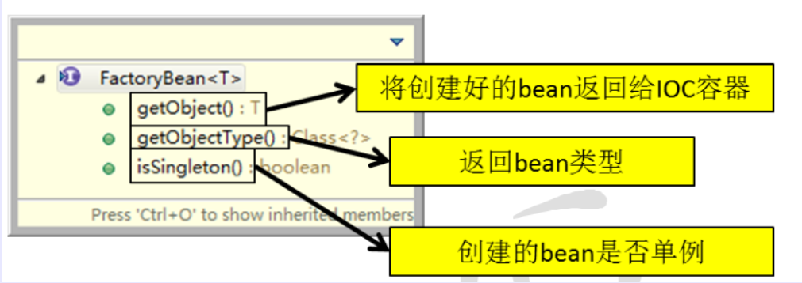
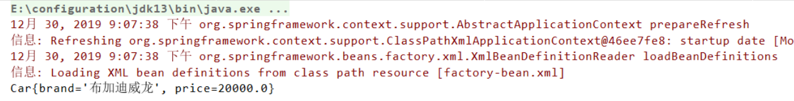

[TOC]

## 一、通过全类名(反射)

从 IOC 容器中获取 bean 时，除了通过 id 值来获取，还可以通过 bean 的类型来获取，但是如果同一个类型的 bean 在 XML 配置文件中配置了多个，则获取时会抛出异常，所以同一个类型的 bean 在容器中必须是唯一的**。**

```java
//使用此方法获取对象时，要求spring所管理的此类型对象只能有1个
Person person = ac.getBean(Person.class);
```

建议使用另一个重载的方法，同时指定 bean 和 id 值和类型。

```java
Person person = ac.getBean("personTwo", Person.class);
```

```xml
<bean id="personTwo" class="com.xuwei.spring.mod.Person">
  <property name="id" value="2"></property>
  <property name="name" value="xuwei2"></property>
</bean>
```

## 二、通过工厂方法获取

- **静态工厂方法：**直接调用某一个类的静态方法就可以返回 Bean 的实例。
- **实例工厂方法**：既需要创建工厂本身，还调用工厂的实例方法返回 bean 的实例

## 三、通过 FactoryBean 来获取

Spring中有两种类型的 bean，一种是普通 bean，另一种是工厂 bean，即 FactoryBean。工厂 bean 跟普通 bean 不同，其返回的对象不是指定类的一个实例，其返回的是该工厂 bean 的 getObject 方法所返回的对象。工厂 bean 必须实现 org.springframework.beans.factory.FactoryBean 接口。



```java
public class Car {
    private String brand;
    private Double price;
}
```

```java
public class MyFactory implements FactoryBean {
    //将创建好的 Bean 返回给 IOC 容器
    public Object getObject() throws Exception {
        Car car = new Car();
        car.setBrand("布加迪威龙");
        car.setPrice(20000.0);
        return car;
    }
    //返回 bean 的类型
    public Class<?> getObjectType() {
        return Car.class;
    }
    //创建的 bean 是否单例
    public boolean isSingleton() {
        return false;
    }
}
```

```java
<!-- 由工厂本身创建的对象     class指向FactoryBean的全类名    property配置FactoryBean的属性 -->
    <bean id="factory" class="com.xuwei.servlet.MyFactory"/>
</beans>
```

```java
public class FactoryTest {
    public static void main(String[] args) {
        ApplicationContext ac = new ClassPathXmlApplicationContext("factory-bean.xml");
        Object obj = ac.getBean("factory");
        System.out.println(obj);
    }
}
```

