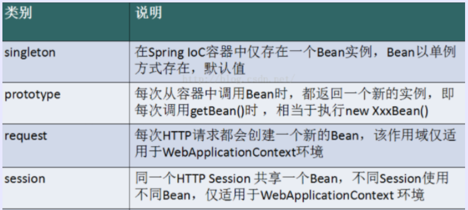

在 Spring 中，那些组成应用程序的主体及由 Spring IOC 容器所管理的对象，称之为 bean。简单的说，bean 就是由 IOC 容器初始化、装配及管理的对象。




## 一、Singleton

当一个 bean 的作用域为 Singleton，那么 Spring IoC 容器中只会存在一个共享的 bean 实例，并且所有对 bean 的请求，只要 id 与该 bean 定义相匹配，则只会返回 bean 的同一实例。Singleton 是单例类型，就是在创建起容器时就同时自动创建了一个 bean 的对象，不管你是否使用，他都存在了，每次获取到的对象都是同一个对象。注意，Singleton 作用域是 Spring 中的缺省作用域。要在 XML 中将 bean 定义成 singleton，可以这样配置：

```xml
<bean id="ServiceImpl" class="cn.csdn.service.ServiceImpl" scope="singleton">
```


## 二、Prototype

当一个 bean 的作用域为 Prototype，表示一个 bean 定义对应多个对象实例。Prototype 作用域的 bean 会导致在每次对该 bean 请求（将其注入到另一个 bean 中，或者以程序的方式调用容器的 getBean() 方法）时都会创建一个新的 bean 实例。Prototype 是原型类型，它在我们创建容器的时候并没有实例化，而是当我们获取 bean 的时候才会去创建一个对象，而且我们每次获取到的对象都不是同一个对象。根据经验，对有状态的 bean 应该使用prototype 作用域，而对无状态的 bean 则应该使用 singleton作 用域。在 XML 中将 bean 定义成 prototype，可以这样配置：

```xml
<bean id="account" class="com.foo.DefaultAccount" scope="prototype"/>  
 或者
<bean id="account" class="com.foo.DefaultAccount" singleton="false"/>
```


## 三、Request

当一个 bean 的作用域为 Request，表示在一次 HTTP 请求中，一个 bean 定义对应一个实例；即每个 HTTP 请求都会有各自的 bean 实例，它们依据某个bean定义创建而成。该作用域仅在基于web的Spring ApplicationContext情形下有效。考虑下面bean定义：

```xml
<bean id="loginAction" class=cn.csdn.LoginAction" scope="request"/>
```


## 四、Session

当一个bean的作用域为 Session，表示在一个 HTTP Session 中，一个 bean 定义对应一个实例。该作用域仅在基于web 的 Spring ApplicationContext 情形下有效。考虑下面 bean 定义：

```xml
<bean id="userPreferences" class="com.foo.UserPreferences" scope="session"/>
```