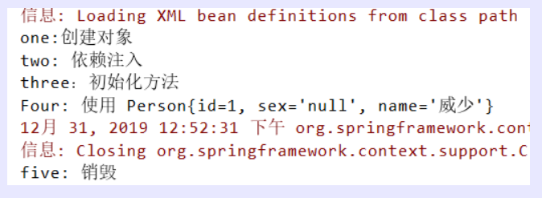

[TOC]

## 一、简述 Bean 的生命周期

Spring IOC 容器对 bean 的生命周期进行管理的过程：

1. 通过构造器或工厂方法创建 bean 实例
2. 为 bean 的属性设置值和对其他 bean 的引用
3. 调用 bean 的初始化方法
4. bean 可以使用了
5. 当容器关闭时，调用 bean 的销毁方法

在配置 bean 时，通过 init-method 和 destroy-method 属性为 bean 指定初始化和销毁方法

```java
public class Person {
    private Integer id;
    private String sex;
    private String name;

    public Person() {
        System.out.println("one:创建对象");
    }

    public Person(Integer id, String sex, String name) {
        this.id = id;
        this.sex = sex;
        this.name = name;
    }

    public void init() {
        System.out.println("three：初始化方法");
    }

    public void destory() {
        System.out.println("five: 销毁");
    }

    public Integer getId() {
        return id;
    }

    public void setId(Integer id) {
        System.out.println("two: 依赖注入");
        this.id = id;
    }

    public String getSex() {
        return sex;
    }

    public void setSex(String sex) {
        this.sex = sex;
    }

    public String getName() {
        return name;
    }

    public void setName(String name) {
        this.name = name;
    }

    @Override
    public String toString() {
        return "Four: 使用 Person{" +
            "id=" + id +
            ", sex='" + sex + '\'' +
            ", name='" + name + '\'' +
            '}';
    }
}
```

注意：在配置bean时，通过 init-method 和 destroy-method 属性为 bean 指定初始化和销毁方法

```xml
<?xml version="1.0" encoding="UTF-8"?>
<beans xmlns="http://www.springframework.org/schema/beans"
       xmlns:xsi="http://www.w3.org/2001/XMLSchema-instance"
       xsi:schemaLocation="http://www.springframework.org/schema/beans http://www.springframework.org/schema/beans/spring-beans.xsd">
    <bean id="person" class="com.xuwei.pojo.Person" init-method="init" destroy-method="destory">
        <property name="id" value="1"/>
        <property name="name" value="威少" />
        <property name="sex" value="男" />
    </bean>
</beans>
```

```java
public class personTest {
    public static void main(String[] args) {
        ClassPathXmlApplicationContext ac = new ClassPathXmlApplicationContext("person-bean.xml");
        Person person = ac.getBean("person", Person.class);
        System.out.println(person);
        ac.close();
    }
}
```





## 二、Bean 的后置处理器

1. bean 后置处理器允许在调用***\*初始化方法前后\****对 bean 进行额外的处理；
2. bean 后置处理器对IOC容器里的所有bean实例逐一处理，而非单一实例。其典型应用是：检查bean属性的正确性或根据特定的标准更改 bean 的属性。
3. bean后置处理器需要实现接口：

1. 1. `org.springframework.beans.factory.config.BeanPostProcessor`。在初始化方法被调用前后，Spring将把每个 bean 实例分别传递给上述接口的以下两个方法：
    2. `postProcessBeforeInitialization(Object, String)`
    3. `postProcessAfterInitialization(Object, String)`

**后置处理器类** 

```java
public class RearProcessor implements BeanPostProcessor {
    @Override
    public Object postProcessBeforeInitialization(Object bean, String beanName) throws BeansException {
        System.out.println("init之前: 检查 bean");
        Person person = (Person) bean;
        if (person.getSex().equals("男")) {
            person.setName("威少2");
        }else {
            person.setName("威少3");
        }
        return person;
    }

    @Override
    public Object postProcessAfterInitialization(Object bean, String beanName) throws BeansException {
        System.out.println("init之后：");
        return bean;
    }
}
```

 **bean 的配置** 

```xml
<bean class="com.xuwei.pojo.RearProcessor" />
```

**添加 bean 后置处理器后 bean 的生命周期**

1. 通过构造器或工厂方法***\*创建bean实例\****
2. 为bean的***\*属性设置值\****和对其他bean的引用
3. 将bean实例传递给bean后置处理器的postProcessBeforeInitialization()方法
4. 调用bean的***\*初始化\****方法
5. 将bean实例传递给bean后置处理器的postProcessAfterInitialization()方法
6. bean可以使用了
7. 当容器关闭时调用bean的***\*销毁方法\****