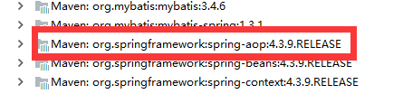

[TOC]

## 一、说明

1. 在spring4之后，想要使用注解形式，必须得要引入aop的包



2. 在配置文件当中，还得要引入一个context约束

```xml
<?xml version="1.0" encoding="UTF-8"?>
<beans xmlns="http://www.springframework.org/schema/beans"
       xmlns:xsi="http://www.w3.org/2001/XMLSchema-instance"
       xmlns:context="http://www.springframework.org/schema/context"
       xsi:schemaLocation="http://www.springframework.org/schema/beans
                           http://www.springframework.org/schema/beans/spring-beans.xsd
                           http://www.springframework.org/schema/context
                           http://www.springframework.org/schema/context/spring-context.xsd">
</beans>
```


## 二、Bean的实现

我们之前都是使用 bean 的标签进行 bean 注入，但是实际开发中，我们一般都会使用注解！

1. 配置扫描哪些包下的注解

```xml
<!-- 指定注解扫描包 -->
<context:component-scan base-package="com.xuwei.pojo"/>
```

2. 在指定包下编写类，增加注解

```java
@Component("user") //相当于配置文件 <bean id="user" class="当前注解的类的全路径名"/>
public class User {
    public String name = "威少";
}
```

3. 测试

```java
public class Test2 {
    public static void main(String[] args) {
        ApplicationContext ac = new ClassPathXmlApplicationContext("spring-config.xml");
        User user = (User) ac.getBean("user");
        System.out.println(user.name); //威少
    }
}
```


## 三、属性注入

1. 可以不用提供set方法，直接在直接名上添加@value("值")

```java
@Component("user") //相当于配置文件 <bean id="user" class="当前注解的类的全路径名"/>
public class User {

    @Value("威少") //相当于配置文件中 <property name="威少" value="秦疆"/>
    public String name;
}
```

2. 如果提供了set方法，在set方法上添加@value("值");

```xml
@Component("user")
public class User {
    public String name;
    @Value("威少")
    public void setName(String name) {
        this.name = name;
    }
}
```


## 四、衍生注解

**@Component三个衍生注解：**为了更好的进行分层，Spring可以使用其它三个注解，功能一样，目前使用哪一个功能都一样。

- @Controller：web 层
- @Service：service 层
- @Repository：dao 层

写上这些注解，就相当于将这个类交给Spring管理装配了！


## 五、作用域 @scope

- singleton：默认的，Spring会采用单例模式创建这个对象。关闭工厂 ，所有的对象都会销毁。
- prototype：多例模式。关闭工厂 ，所有的对象不会销毁。内部的垃圾回收机制会回收。

```java
@Scope("prototype")
@Controller("user") //相当于配置文件 <bean id="user" class="当前注解的类的全路径名"/>
public class User {

    @Value("威少") //相当于配置文件中 <property name="威少" value="秦疆"/>
    public String name;
}
```


## 六、小结

**XML与注解比较**

- XML可以适用任何场景 ，结构清晰，维护方便
- 注解不是自己提供的类使用不了，开发简单方便


**xml与注解整合开发** ：推荐最佳实践

- xml管理Bean
- 注解完成属性注入
- 使用过程中， 可以不用扫描，扫描是为了类上的注解

```xml
<context:annotation-config/>
```

**作用：**

- 进行注解驱动注册，从而使注解生效
- 用于激活那些已经在spring容器里注册过的bean上面的注解，也就是显示的向Spring注册
- 如果不扫描包，就需要手动配置bean
- 如果不加注解驱动，则注入的值为null！


## 七、基于Java类进行配置

JavaConfig 原来是 Spring 的一个子项目，它通过 Java 类的方式提供 Bean 的定义信息，在 Spring4 的版本， JavaConfig 已正式成为 Spring4 的核心功能 。

1. 编写一个实体类，Dog

```java
@Component  //将这个类标注为Spring的一个组件，放到容器中！
public class Dog {
    public String name = "dog";
}
```

2. 新建一个config配置包，编写一个MyConfig配置类

```java
@Configuration  //代表这是一个配置类
public class MyConfig {
    @Bean //通过方法注册一个bean，这里的返回值就Bean的类型，方法名就是bean的id！
    public Dog dog(){
        return new Dog();
    }
}
```

3. 测试

```java
@Test
public void test2(){
    ApplicationContext applicationContext =
            new AnnotationConfigApplicationContext(MyConfig.class);
    Dog dog = (Dog) applicationContext.getBean("dog");
    System.out.println(dog.name);
}
```


4. 成功输出结果！**导入其他配置如何做呢？**

5. 我们再编写一个配置类！

```java
@Configuration  //代表这是一个配置类
public class MyConfig2 {
}
```

6. 在之前的配置类中我们来选择导入这个配置类

```java
@Configuration
@Import(MyConfig2.class)  //导入合并其他配置类，类似于配置文件中的 inculde 标签
public class MyConfig {
    @Bean
    public Dog dog(){
        return new Dog();
    }
}
```

关于这种Java类的配置方式，我们在之后的SpringBoot 和 SpringCloud中还会大量看到，我们需要知道这些注解的作用即可！


