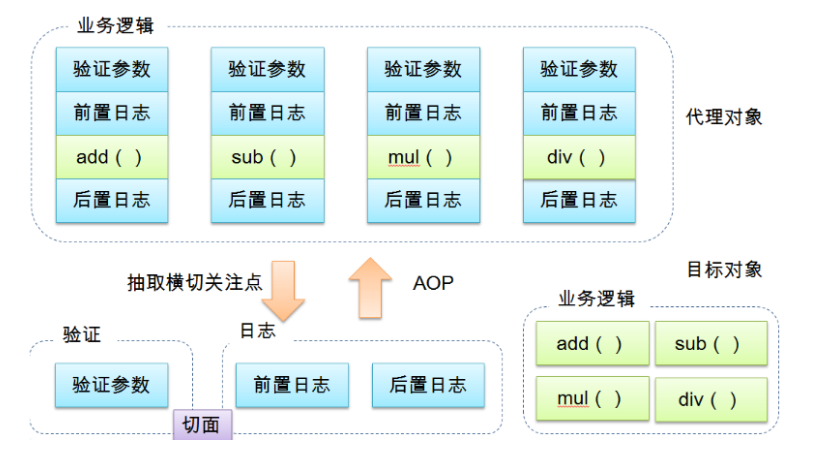
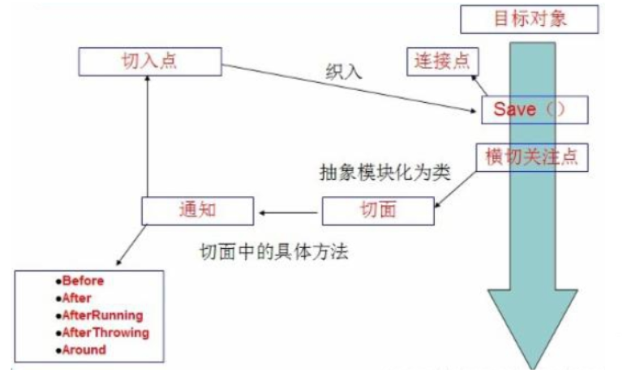

[TOC]

## 一、什么是 AOP

 AOP（Aspect Oriented Programming）意为：面向切面编程，通过预编译方式和运行期动态代理实现程序功能的统一维护的一种技术。AOP 是 OOP 的延续，是软件开发中的一个热点，也是 Spring 框架中的一个重要内容，是函数式编程的一种衍生范型。利用AOP可以对业务逻辑的各个部分进行隔离，从而使得业务逻辑各部分之间的耦合度降低，提高程序的可重用性，同时提高了开发的效率。 

## 二、AOP 在 Spring 中的作用

**提供声明式事务；允许用户自定义切面**

- 横切关注点：跨越应用程序多个模块的方法或功能。即是，与我们业务逻辑无关的，但是我们需要关注的部分，就是横切关注点。如日志 , 安全 , 缓存 , 事务等等 ....
- 切面（ASPECT）：横切关注点被模块化的特殊对象。即，它是一个类。
- 通知（Advice）：切面必须要完成的工作。即，它是类中的一个方法。
- 目标（Target）：被通知对象。
- 代理（Proxy）：向目标对象应用通知之后创建的对象。
- 切入点（PointCut）：切面通知 执行的 “地点”的定义。
- 连接点（JointPoint）：与切入点匹配的执行点。

方式一：使用 Spring 的 API 来实现接口 【主要是 Spring API 接口实现】

方式二：自定义来实现 AOP 【主要是 切面】

方式三：使用注解实现！

