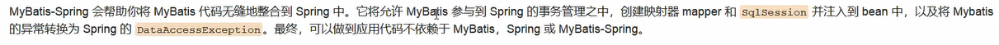

步骤：

1. 导入相关 jar 包；
    1. junit
    2. mybatis
    3. mysql
    4. spring 相关的
    5. aop 
    6. mybatis-spring
2. 编写配置文件；
3. 测试

## 回忆 MyBatis

1. 编写实体类
2. 编写核心配置文件
3. 编写接口
4. 编写 Mapper.xml
5. 测试

## MyBatis-Spring

1. 编写数据源配置；
2. sqlSessionFactory
3. sqlSessionTemplate
4. 需要给接口加实现类
5. 将自己写的实现类，注入到 Spring 中
6. 