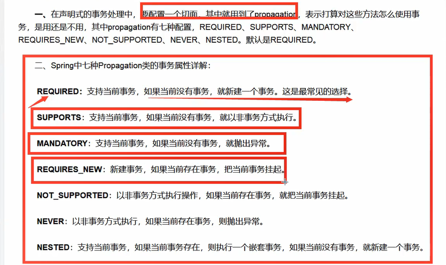
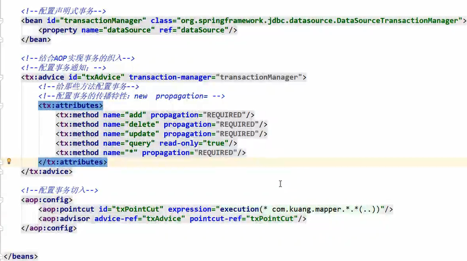

## 一、回顾事务

- 把一组业务当成一个业务来做；要么都成功，要么都失败

- 事务在项目开发中，十分的重要，涉及到数据的一致性问题，不能马虎！
- 确保完整性和一致性

事务 ACID 原则：

- 原子性
- 一致性
- 隔离性
- 持久性
    - 事务一旦提交，无论系统发生什么问题，结果都不会再被影响。

## 二、

- 声明式事务：交由容器管理事务。
- 编程式事务管理：

