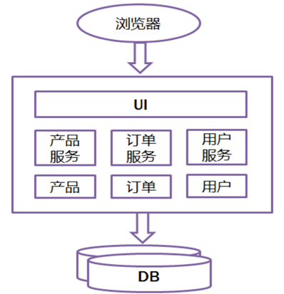
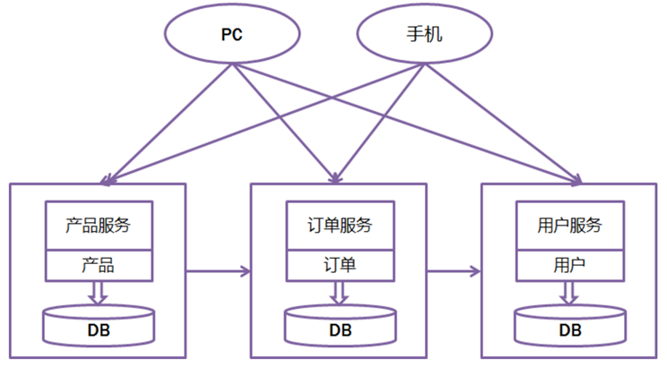

[TOC]

## 一、SpringBoot 简介

Spring Boot 是由 Pivotal 团队提供的全新框架，其设计目的是用来简化新 Spring 应用的初始搭建以及开发过程。

- 该框架使用了特定的方式来进行配置，从而使开发人员不再需要定义样板化的配置。　　

- 通过这种方式，Spring Boot 致力于在蓬勃发展的快速应用开发领域（rapidapplication development）成为领导者。

## 二、为什么要用 SpringBoot

- 创建独立的 Spring 应用程序；
- 嵌入式的 Tomcat，无需部署 WAR 文件；
- 简化 Maven 配置；
- 自动配置 Spring；
- 开箱即用，没有代码生成，也无需 XML 配置；

## 三、特性理解

- 为基于 Spring 的开发提供更快的入门体验；
- 开箱即用，没有代码生成，也无需 XML 配置。同时也可以修改默认值来满足特定的需求；
- 提供了一些大型项目中常见的非功能特性，如嵌入式服务器、安全、指标，健康检测、外部配置等；
- Spring Boot 并不是对 Spring 功能上的增强，而是提供了一种快速使用 Spring 的方式；

## 四、传统开发 VS 微服务开发

### 1、传统开发

所有的功能打包在一个 WAR包里，基本没有外部依赖（除了容器），部署在一个JEE容器（Tomcat，JBoss，WebLogic）里，包含了 DO/DAO，Service，UI等所有逻辑。

优点：

1. **开发简单，集中式管理；**
2. **基本不会重复开发；**
3. **功能都在本地，没有分布式的管理和调用消耗。**

缺点：

1. **效率低：开发都在同一个项目改代码，相互等待，冲突不断；**

2. **维护难：代码功功能耦合在一起，新人不知道何从下手；**

3. **不灵活：构建时间长，任何小修改都要重构整个项目，耗时；**

4. **稳定性差：一个微小的问题，都可能导致整个应用挂掉；**

5. **扩展性不够：无法满足高并发下的业务需求；**

6. **对服务器的性能要求要统一，要高。**

### 2、微服务开发

微服务：架构风格(服务微化)，是指开发一个单个小型的但有业务功能的服务，每个服务都有自己的处理和轻量通信机制，可以部署在单个或多个服务器上，微服务也指一种松耦合的，有一定有界上下文的**面向服务的架构** 。

目的：**有效的拆分应用，实现敏捷开发和部署。**

优点

1. **每个微服务都很小，这样能聚焦一个指定的业务功能或业务需求**

2. **微服务能够被小团队开发，这个小团队2-5人就可以完成了**

3. **微服务是松耦合的，是有功能，有意义的服务，无论在开发阶段或部署阶段都是独立的**

4. **微服务可以使用不同的语言开发**

5. **微服务能部署在中低端配置的服务器上**

6. **很容易和第三方集成**

7. **每个服务都有自己的存储能力，单独的库，也可以有统一的库**

缺点

1. **微服务会带来过多的操作**

2. **可以有双倍的努力** 

3. **分布式系统可能复杂难管理**

4. **分布跟踪部署难**

5. **当服务数量增加时，管理复杂度增加**