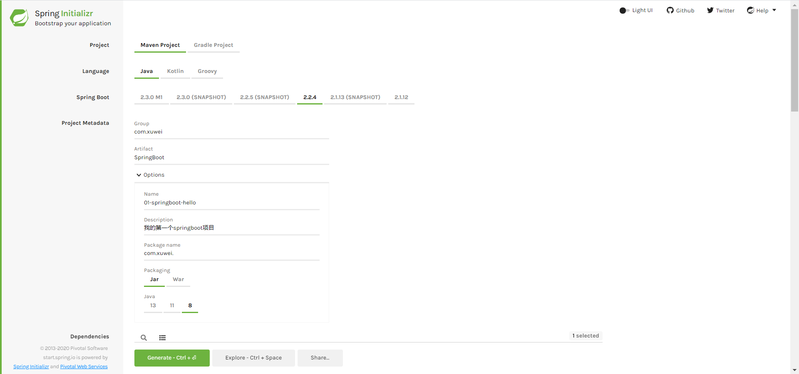
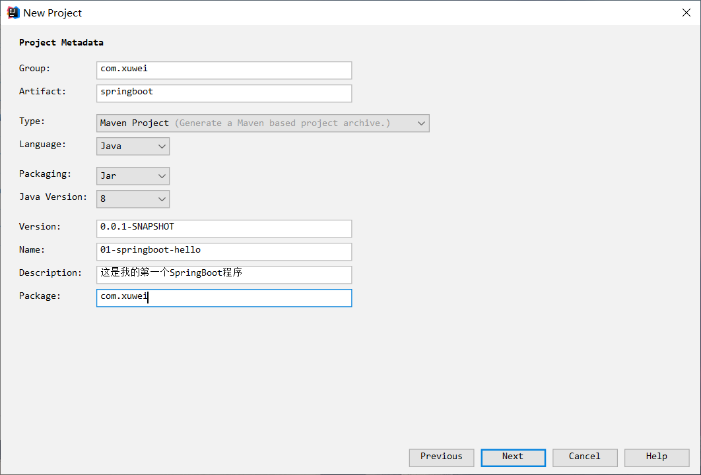
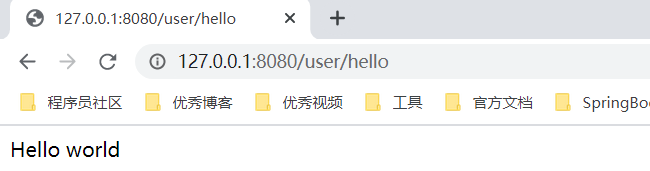

[TOC]

## 一、环境准备

① JDK1.8	② maven3.x	③ Spring tools suite3.9	④ spring2.x 版本	⑤ spring5

## 二、创建项目

不管使用工具还是使用这个网站start.spring.io，本质都是访问这个网站，把项目创建好然后导入到工具中。





## 三、pom.xml 的配置说明

```xml
<?xml version="1.0" encoding="UTF-8"?>
<project xmlns="http://maven.apache.org/POM/4.0.0" xmlns:xsi="http://www.w3.org/2001/XMLSchema-instance"
         xsi:schemaLocation="http://maven.apache.org/POM/4.0.0 https://maven.apache.org/xsd/maven-4.0.0.xsd">
    <modelVersion>4.0.0</modelVersion>
    <!-- 继承springboot的父项目 -->
    <parent>
        <groupId>org.springframework.boot</groupId>
        <artifactId>spring-boot-starter-parent</artifactId>
        <version>2.2.4.RELEASE</version>
        <relativePath/> <!-- lookup parent from repository -->
    </parent>
    <groupId>com.xuwei</groupId>
    <artifactId>springboot</artifactId>
    <version>0.0.1-SNAPSHOT</version>
    <name>springboot</name>
    <description>这是我的第一次springboot程序</description>

    <!-- 配置版本 -->
    <properties>
        <java.version>1.8</java.version>
    </properties>

    <dependencies>
        <!-- 添加springboot对web的依赖 -->
        <dependency>
            <groupId>org.springframework.boot</groupId>
            <artifactId>spring-boot-starter-web</artifactId>
        </dependency>

        <!-- 添加测试依赖 -->
        <dependency>
            <groupId>org.springframework.boot</groupId>
            <artifactId>spring-boot-starter-test</artifactId>
            <scope>test</scope>
            <exclusions>
                <exclusion>
                    <groupId>org.junit.vintage</groupId>
                    <artifactId>junit-vintage-engine</artifactId>
                </exclusion>
            </exclusions>
        </dependency>

    </dependencies>

    <build>
        <plugins>
            <!-- maven 插件的配置 -->
            <plugin>
                <groupId>org.springframework.boot</groupId>
                <artifactId>spring-boot-maven-plugin</artifactId>
            </plugin>
        </plugins>
    </build>

</project>
```

## 四、创建 UserController

```java
@Controller
@RequestMapping("user")
public class UserController {

    @RequestMapping("hello")
    @ResponseBody
    public String helloUser() {
        return "Hello world";
    }
}
```

## 五、启动测试



## 六、补充插件

- backgroundimagePlus
- maven Helper
- lombok 插件