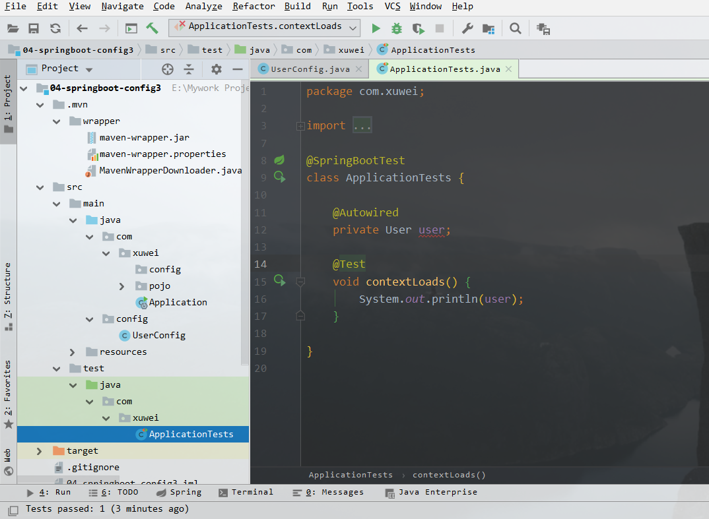

[TOC]

## 一、回顾学过的 Spring 的注解

@Controller、@RestController、@Service、@Repostory、@Compment、@RequsetMapping、@GetMapping、@PostMapping、@DeleteMapping、@PutMapping、@PatchMapping、@Autowired、@RequestBody、@ResponseBody

## 二、新注解学习

- @Configuration：作用在类上，相当于一个 xml 配置文件，比如 application-dao.xml；
- @Bean：作用于方法上，相当于 xml 配置中的 <bean>，但是当 Bean 注解的方法有形参时，会从 IOC 容器里面取对象，默认有 @Autowired 这样一个注解；
- @Import：在创建配置文件之后可以引入其他的配置文件，如 <import resource=“classpath:application-dao.xml">
- @ComponentScan("com.xuwei")：配置扫描。
- @Qualifier：qualifier 的意思是合格者，通过这个标识，表明哪个实现类才是我们所需要的，需要注解的是，@Qualifier的参数名称必须是我们之前定义@Bean 注解的名称之一。
- @Primary：主要的，当 IOC 容器里有多个对象，那么会有冲突，可以使用 @Qualifier，也可以使用这个注解来标记它为主要的使用对象。该注解优先级低于 @Qualifier。

### 1、@Configuration

1. 创建 User 类

```java
@Data   //生成get,set,toString,equals,hashCode方法
@AllArgsConstructor //生成满参的构造器
@NoArgsConstructor //生成无参构造器
public class User {
    private Integer id;
    private String name;
    private String address;
}
```

2. 创建 UserConfig 类

```java
@Configuration //作用在类上，相当于创建了一spring的xml配置文件
public class UserConfig {}
```

### 2、@Bean

1. 在 UserConfig 类中添加方法

```java
@Configuration
public class UserConfig {

    @Bean //相当于xml文件中 <bean id="user" class="">
    public User getUser1() {
        return new User(1, "威少", "韩城");
    }
}
```

2. 在测试文件中添加如下代码：

```java
@SpringBootTest
class ApplicationTests {

    @Autowired
    private User user;

    @Test
    void contextLoads() {
        System.out.println(user);
    }

}
```

### 3、@Import

1. 将 com.xuwei.config.UserConfig 文件放在 java.config 目录下，发现报错;



2. 在 com.xuwei.config 目录下创建 AppConfig 文件，引入相应的配置文件;

```java
@Import(value = {UserConfig.class})
@Configuration
public class AppConfig {}
```

3. 运行测试，成功运行。

### 4、@ComponentScan("com.xuwei")

1. 将 AppConfig 中的 @Import 注解注释掉；
2. 在 Application 文件中添加注解 @ComponentScan，就会自动扫描该包下的文件。

```java
@SpringBootApplication
@ComponentScan(basePackages = "config")
public class Application {
    public static void main(String[] args) {
        SpringApplication.run(Application.class, args);
    }
}
```

### 5、@Qualifier

1. 修改 UserConfig 的代码。

```java
@Configuration
public class UserConfig {

    @Bean("user1") //相当于xml文件中 bean
    public User getUser1() {
        return new User(1, "威少", "韩城");
    }

    @Bean("user2") //相当于xml文件中 bean
    public User getUser2() {
        return new User(2, "威少", "韩城");
    }
}
```

2. 在测试文件中添加 @Qualifier 指明我们所需要的类

```java
@SpringBootTest
class ApplicationTests {

    @Qualifier("user1")
    @Autowired
    private User user;

    @Test
    void contextLoads() {
        System.out.println(user);
    }

}
```

### 6、@Primary

1. 在 UserConfig 文件下的某一个 Bean 上添加 @Primary，表明该对象为主要使用，且优先级低于 @Qualifier 声明的；

```java
@Configuration
public class UserConfig {

    @Bean("user1") //相当于xml文件中 bean
    public User getUser1() {
        return new User(1, "威少", "韩城");
    }

    @Primary
    @Bean("user2") //相当于xml文件中 bean
    public User getUser2() {
        return new User(2, "威少", "韩城");
    }
}
```

2. 其他条件不变，@Qualifier 依然声明标识 user1。


### 7、Bean 有形参

1. 修改 UserConfig 代码；

```java
@Configuration
public class UserConfig {

    @Bean("user1") //相当于xml文件中 bean
    public User getUser1() {
        return new User(1, "威少", "韩城");
    }

//    @Primary
    @Bean("user2") //相当于xml文件中 bean
    public User getUser2() {
        return new User(2, "威少", "韩城");
    }

    @Bean("user3") //相当于xml文件中 bean
    public User getUser3(User user) {
        return user;
    }
}
```

2. 注释掉 @Primary ;
3. 在测试文件中声明标识 user3；
4. 运行测试报错；
5. 解决：在  getUser3() 的形参中添加注解，表明标识哪一个 user，且修改该 user 的名字为 666;

```java
@Bean("user3") //相当于xml文件中 bean
public User getUser3(@Qualifier("user1") User user) {
    user.setName("666");
    return user;
}
```

6. 再次运行测试，user1 中的名字已经被修改；


7. 直接在测试文件中声明 user1，查看 name 已然被修改。

