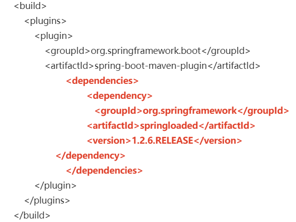

[TOC]

## 一、什么是热部署

spring 为开发者提供了一个名为 spring-boot-devtools 的模块来使 springboot 应用支持热部署，提高开发的效率，修改代码后无需重启应用。

## 二、热部署的三种方式

### 1、使用 Spring 提供的 devtools

1. 在 pom.xml 中添加依赖

```xml
<!-- 添加热部署依赖 -->
<dependency>
    <groupId>org.springframework.boot</groupId>
    <artifactId>spring-boot-devtools</artifactId>
    <scope>runtime</scope>
    <!-- optional=true，依赖不会传递，该项目依赖 devtools，之后依赖 boot 项目的项目如果想要使用 devtools, 需要重新引入 -->
    <optional>true</optional>
</dependency>
```

2. 开启热部署（2.0 可以不配置）

```
server.port=8081
#\u5F00\u542F
spring.devtools.restart.enabled=true
#\u76D1\u542C\u76EE\u5F55
#spring.devtools.restart.additional-paths=src/main/java
```

### 2、使用 springloaded 本地加载启动

1. 下载 springloded 工具包到一个指定目录（我直接用 maven 仓库地址）；
2. 在启动项目时，在 jvm 参数中输入命令：

```
-javaagent:D:\Maven\repository\org\springframework\springloaded\1.2.6.RELEASE\springloaded-1.2.6.RELEASE.jar -noverify
```

注意：

- -javaagent：命令后跟冒号，意思是在执行 main 方法前执行特定代码；
- -noverify：关闭 java 字节码校验功能。

### 3、使用 springloaded 配置 pom.xml

1. 在 pom.xml 配置文件中添加如下代码：



2. 启动方式变为 maven 启动，即在项目的文件夹 dos 窗口输入命令 `mvn spring-boot:run`

