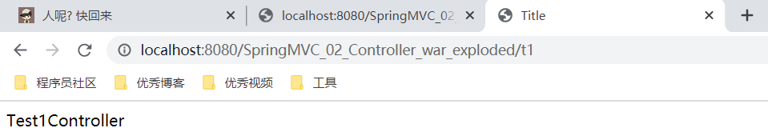
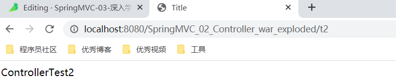
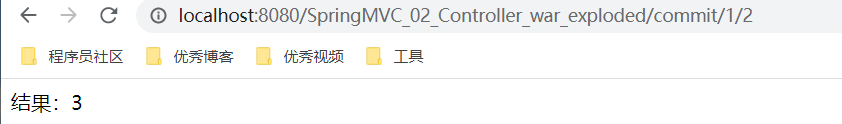
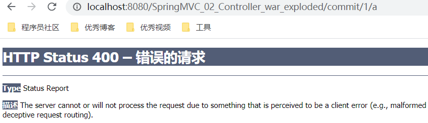
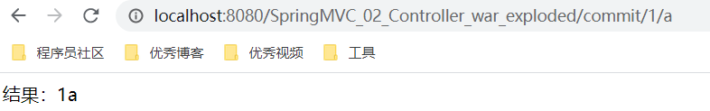
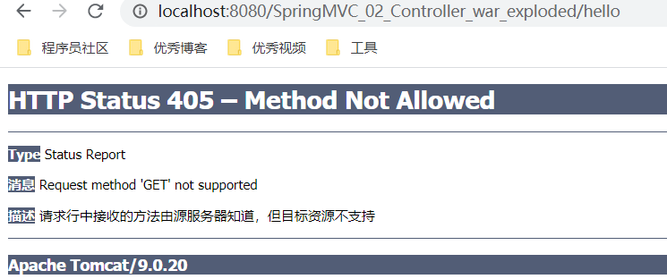
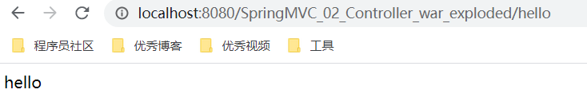
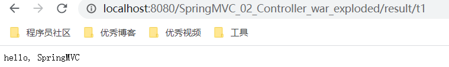
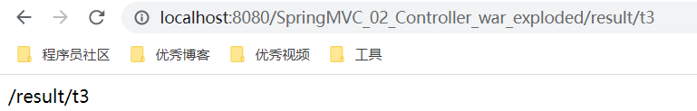
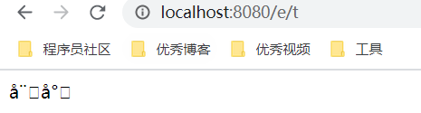

# 02--深入学习

## 一、控制器 Controller

### 1、概述

- 控制器复杂提供访问应用程序的行为，通常通过接口定义或注解定义两种方法实现。
- **控制器负责解析用户的请求并将其转换为一个模型。**
- 在Spring MVC中一个控制器类可以包含多个方法
- 在Spring MVC中，对于Controller的配置方式有很多种


### 2、实现 Controller 接口

1、新建一个Moudle，SpringMVC-02-Controller，将刚才的 HelloWorld 拷贝一份，删掉 HelloController。

2、编写一个 Controller 类，ControllerTest1


```
/**
 * @author xuwei
 * @create 2020-01-20 11:01
 */
//定义控制器
public class ControllerTest1 implements Controller {
    @Override
    public ModelAndView handleRequest(HttpServletRequest httpServletRequest, HttpServletResponse httpServletResponse) throws Exception {
        ModelAndView mv = new ModelAndView();
        mv.addObject("msg", "Test1Controller");
        mv.setViewName("test");
        return mv;
    }
}
```


3、在 springmvc-servlet.xml 中注册 bean。


```
<bean name="/t1" class="com.kuang.controller.ControllerTest1"/>
```


4、编写前端 test.jsp，注意在 WEB-INF/jsp 目录下编写，对应我们的视图解析器


```
<%@ page contentType="text/html;charset=UTF-8" language="java" %>
<html>
<head>
    <title>Title</title>
</head>
<body>
    ${msg}
</body>
</html>
```


5、配置 tomcat 运行测试





6、说明

- 实现接口Controller定义控制器是较老的办法
- 缺点是：一个控制器中只有一个方法，如果要多个方法则需要定义多个Controller；定义的方式比较麻烦；


### 3、使用注解 @controller

- @Controller注解类型用于声明Spring类的实例是一个控制器（在讲IOC时还提到了另外3个注解）；
- Spring可以使用扫描机制来找到应用程序中所有基于注解的控制器类，为了保证Spring能找到你的控制器，需要在配置文件中声明组件扫描。


```
<!-- 自动扫描指定的包，下面所有注解类交给IOC容器管理 -->
<context:component-scan base-package="com.xuwei.controller"/>
```


- 增加一个ControllerTest2类，使用注解实现；


```
//@Controller注解的类会自动添加到 Spring 上下文中
@Controller
public class ControllerTest2 {

    @RequestMapping("/t2")
    public String hello(Model model) {
        model.addAttribute("msg", "ControllerTest2");
        return "test";
    }
}
```


- 运行 tomcat 测试





**可以发现，我们的两个请求都可以指向一个视图，但是页面结果的结果是不一样的，从这里可以看出视图是被复用的，而控制器与视图之间是弱偶合关系。**

**
**

**如果同时使用实现和注解，且都是访问同一个路径，以注解为准。**


## 二、RequestMapping

- @RequestMapping注解用于映射url到控制器类或一个特定的处理程序方法。可用于类或方法上。用于类上，表示类中的所有响应请求的方法都是以该地址作为父路径。
- 同时注解类与方法


```
@Controller
@RequestMapping("/rm")
public class ControllerTest3 {

    @RequestMapping("/t2")
    public String hello(Model model) {
        model.addAttribute("msg", "ControllerTest2");
        return "test";
    }
}
```


访问路径：[http://localhost](http://localhost/):8080 / 项目名/ rm/t2 , 需要先指定类的路径再指定方法的路径；


## 三、RestFul 风格

### 1、概述

- 资源操作：使用POST、DELETE、PUT、GET，使用不同方法对资源进行操作。
- 分别对应 添加、 删除、修改、查询。


### 2、传统方式操作资源

通过不同的参数来实现不同的效果！方法单一，post 和 get

- http://127.0.0.1/item/queryItem.action?id=1 查询,GET
- http://127.0.0.1/item/saveItem.action 新增,POST
- http://127.0.0.1/item/updateItem.action 更新,POST
- http://127.0.0.1/item/deleteItem.action?id=1 删除,GET或POST


### **3、使用RESTful操作资源**

可以通过不同的请求方式来实现不同的效果！如下：请求地址一样，但是功能可以不同！

- http://127.0.0.1/item/1 查询,GET
- http://127.0.0.1/item 新增,POST
- http://127.0.0.1/item 更新,PUT
- http://127.0.0.1/item/1 删除,DELETE


**1、新建一个类 ControllerTest4**


```
@Controller
public class RestFulController {
}
```

 

**2、在 SpringMVC** **中可以使用 @PathVariable 注解，让方法参数的值对应绑定到一个URI模板变量上。**


```
@Controller
public class ControllerTest4 {

    //映射访问路径
    @RequestMapping("/commit/{p1}/{p2}")
    public String hello(@PathVariable int p1, @PathVariable int p2, Model model) {
        int result = p1 + p2;
        model.addAttribute("msg", "结果：" + result);
        return "test";
    }
}
```


**3、查看测试结果**





思考：使用路径变量的好处？

- 使路径变得更加简洁；
- 获得参数更加方便，框架会自动进行类型转换。
- 通过路径变量的类型可以约束访问参数，如果类型不一样，则访问不到对应的请求方法，如这里访问是的路径是/commit/1/a，则路径与方法不匹配，而不会是参数转换失败。





**4、修改对应的参数类型，再次测试**


```
@Controller
public class ControllerTest4 {

    //映射访问路径
    @RequestMapping("/commit/{p1}/{p2}")
    public String hello(@PathVariable int p1, @PathVariable String p2, Model model) {
        String result = p1 + p2;
        model.addAttribute("msg", "结果：" + result);
        return "test";
    }
}
```





**使用 method 属性指定请求类型**

用于约束请求的类型，可以收窄请求范围。指定请求谓词的类型如 GET, POST, HEAD, OPTIONS, PUT, PATCH, DELETE, TRACE等


**5、增加一个方法**


```
@RequestMapping(value = "/hello", method = RequestMethod.POST)
public String hello2(Model model) {
    model.addAttribute("msg", "hello");
    return "test";
}
```


- **查看结果**

**
**




- 如果将 POST 改为 GET 则正常了；


```
@RequestMapping(value = "/hello", method = RequestMethod.GET)
public String hello2(Model model) {
    model.addAttribute("msg", "hello");
    return "test";
}
```





**6、总结：**

Spring MVC 的 @RequestMapping 注解能够处理 HTTP 请求的方法, 比如 GET, PUT, POST, DELETE 以及 PATCH。**所有的地址栏请求默认都会是 HTTP GET 类型的。**

方法级别的注解变体有如下几个： 组合注解


```
@GetMapping
@PostMapping
@PutMapping
@DeleteMapping
@PatchMapping
```


@GetMapping 是一个组合注解：它所扮演的是 @RequestMapping(method =RequestMethod.GET) 的一个快捷方式。平时使用的会比较多！


## 四、结果跳转方式

### 1、ServletAPI

通过设置ServletAPI , 不需要视图解析器 。

1. **通过HttpServletResponse进行输出**
2. **通过HttpServletResponse实现重定向**
3. **通过HttpServletResponse实现转发**


```
@RequestMapping("/result/t1")
public void test1(HttpServletRequest req, HttpServletResponse resp) throws IOException {
    resp.getWriter().println("hello, SpringMVC");
}

@RequestMapping("/result/t2")
public void test2(HttpServletRequest req, HttpServletResponse resp) throws IOException {
    //重定向
    resp.sendRedirect("/SpringMVC_02_Controller_war_exploded/index.jsp");
}

@RequestMapping("/result/t3")
public void test3(HttpServletRequest req, HttpServletResponse resp) throws IOException, ServletException {
    //转发
    req.setAttribute("msg", "/result/t3");
    req.getRequestDispatcher("/WEB-INF/jsp/test.jsp").forward(req, resp);
}
```







### 2、SpringMVC 实现转发和重定向

**1、通过SpringMVC来实现转发和重定向 - 无需视图解析器；**

测试前，需要将视图解析器注释掉


```
@Controller
public class ResultSpringMVC {

    @RequestMapping("/rsm/t1")
    public String test1() {
        //转发，不需要加项目名
        return "/index.jsp";
    }

    @RequestMapping("/rsm/t2")
    public String test2() {
        //转发二
        return "forward:/index.jsp";
    }

    @RequestMapping("/rsm/t3")
    public String test3() {
        //重定向
        return "redirect:/index.jsp";
    }
}
```


**2、通过SpringMVC来实现转发和重定向 - 有视图解析器；**

重定向 , 不需要视图解析器 , 本质就是重新请求一个新地方嘛 , 所以注意路径问题。

可以重定向到另外一个请求实现 。


## 五、数据处理

### 1、处理提交数据

#### 1.1 提交的域名称和处理方法的参数名一致

- 提交数据 : [http://localhost](http://localhost/):8080/hello?name=weishao
- 处理方法：


```
@RequestMapping("/hello")
public String hello(String name){
    System.out.println(name);
    return "hello";
}
```


- 后台输出 : weishao


#### 1.2 提交的域名称和处理方法的参数名不一致

- 提交数据 : [http://localhost](http://localhost/):8080/hello?**username**=weishao
- 处理方法 :


```
//@RequestParam("username") : username提交的域的名称 .
@RequestMapping("/hello")
public String hello(@RequestParam("username") String name){
    System.out.println(name);
    return "hello";
}
```


- 后台输出 : weishao


#### 1.3 提交的是一个对象

- 要求提交的表单域和对象的属性名一致 , 参数使用对象即可

1. 实体类


```
public class User {
    private int id;
    private String name;
    private int age;
    //构造
    //get/set
    //tostring()
}
```


1. 提交数据：http://localhost:8080/SpringMVC_02_Controller_war_exploded/user?name=weishao&id=1&age=12
2. 处理方法


```
@RequestMapping("/user")
public String user(User user){
    System.out.println(user);
    return "hello";
}
```


后台输出 :User{id=1, name='weishao', age=12}

**说明：如果使用对象的话，前端传递的参数名和对象名必须一致，否则就是null。**


**
**

### 2、数据显示到前端

#### 2.1 **第一种 : 通过ModelAndView**


```
public class ControllerTest1 implements Controller {

    public ModelAndView handleRequest(HttpServletRequest httpServletRequest, HttpServletResponse httpServletResponse) throws Exception {
        //返回一个模型视图对象
        ModelAndView mv = new ModelAndView();
        mv.addObject("msg","ControllerTest1");
        mv.setViewName("test");
        return mv;
    }
}
```


#### 2.2 **第二种 : 通过ModelMap**


```
@RequestMapping("/hello")
public String hello(@RequestParam("username") String name, ModelMap model){
    //封装要显示到视图中的数据
    //相当于req.setAttribute("name",name);
    model.addAttribute("name",name);
    System.out.println(name);
    return "hello";
}
```


#### 2.3 **第三种 : 通过Model**


```
@RequestMapping("/ct2/hello")
public String hello(@RequestParam("username") String name, Model model){
    //封装要显示到视图中的数据
    //相当于req.setAttribute("name",name);
    model.addAttribute("msg",name);
    System.out.println(name);
    return "test";
}
```


#### 2.4 三种使用区别

- Model 只有寥寥几个方法只适合用于储存数据，简化了新手对于Model对象的操作和理解；
- ModelMap 继承了 LinkedMap ，除了实现了自身的一些方法，同样的继承 LinkedMap 的方法和特性；
- ModelAndView 可以在储存数据的同时，可以进行设置返回的逻辑视图，进行控制展示层的跳转。


## 六、乱码问题

### 1、测试步骤

1. 在首页编写一个提交的表单


```
<form action="/e/t" method="post">
  <input type="text" name="name">
  <input type="submit">
</form>
```


1. 后台编写对应的处理类


```
@Controller
public class StatementTest {
    @RequestMapping("/e/t")
    public String test(Model model, String name) {
        model.addAttribute("msg", name); //获取表单提交的值
        return "test"; //跳转到test页面显示输入的值
    }
}
```


1. 输入中文测试





### 2、解决办法

#### 2.1 修改 tomcat 的配置文件：设置编码


```
<Connector URIEncoding="utf-8" port="8080" protocol="HTTP/1.1"
           connectionTimeout="20000"
           redirectPort="8443" />
```


#### 2.2 使用 SpringMVC 自带的过滤器


```
<!-- 配置 SpringMVC 的乱码过滤器，一般情况这个就够了-->
<filter>
  <filter-name>encoding</filter-name>
  <filter-class>org.springframework.web.filter.CharacterEncodingFilter</filter-class>
  <init-param>
    <param-name>encoding</param-name>
    <param-value>utf-8</param-value>
  </init-param>
</filter>
<filter-mapping>
  <filter-name>encoding</filter-name>
  <url-pattern>/*</url-pattern>
</filter-mapping>
```


#### 2.3 大佬写的过滤器


```
<!-- 通用的大佬写的过滤器 -->
<filter>
  <filter-name>encoding</filter-name>
  <filter-class>com.xuwei.filter.GenericEncodingFilter</filter-class>
</filter>

<filter-mapping>
  <filter-name>encoding</filter-name>
  <url-pattern>/*</url-pattern>
</filter-mapping>
```


```
import javax.servlet.*;
import javax.servlet.http.HttpServletRequest;
import javax.servlet.http.HttpServletRequestWrapper;
import javax.servlet.http.HttpServletResponse;
import java.io.IOException;
import java.io.UnsupportedEncodingException;
import java.util.Map;

/**
 * 解决get和post请求 全部乱码的过滤器
 */
public class GenericEncodingFilter implements Filter {

    @Override
    public void destroy() {
    }

    @Override
    public void doFilter(ServletRequest request, ServletResponse response, FilterChain chain) throws IOException, ServletException {
        //处理response的字符编码
        HttpServletResponse myResponse=(HttpServletResponse) response;
        myResponse.setContentType("text/html;charset=UTF-8");

        // 转型为与协议相关对象
        HttpServletRequest httpServletRequest = (HttpServletRequest) request;
        // 对request包装增强
        HttpServletRequest myrequest = new MyRequest(httpServletRequest);
        chain.doFilter(myrequest, response);
    }

    @Override
    public void init(FilterConfig filterConfig) throws ServletException {
    }

}

//自定义request对象，HttpServletRequest的包装类
class MyRequest extends HttpServletRequestWrapper {

    private HttpServletRequest request;
    //是否编码的标记
    private boolean hasEncode;
    //定义一个可以传入HttpServletRequest对象的构造函数，以便对其进行装饰
    public MyRequest(HttpServletRequest request) {
        super(request);// super必须写
        this.request = request;
    }

    // 对需要增强方法 进行覆盖
    @Override
    public Map getParameterMap() {
        // 先获得请求方式
        String method = request.getMethod();
        if (method.equalsIgnoreCase("post")) {
            // post请求
            try {
                // 处理post乱码
                request.setCharacterEncoding("utf-8");
                return request.getParameterMap();
            } catch (UnsupportedEncodingException e) {
                e.printStackTrace();
            }
        } else if (method.equalsIgnoreCase("get")) {
            // get请求
            Map<String, String[]> parameterMap = request.getParameterMap();
            if (!hasEncode) { // 确保get手动编码逻辑只运行一次
                for (String parameterName : parameterMap.keySet()) {
                    String[] values = parameterMap.get(parameterName);
                    if (values != null) {
                        for (int i = 0; i < values.length; i++) {
                            try {
                                // 处理get乱码
                                values[i] = new String(values[i]
                                                       .getBytes("ISO-8859-1"), "utf-8");
                            } catch (UnsupportedEncodingException e) {
                                e.printStackTrace();
                            }
                        }
                    }
                }
                hasEncode = true;
            }
            return parameterMap;
        }
        return super.getParameterMap();
    }

    //取一个值
    @Override
    public String getParameter(String name) {
        Map<String, String[]> parameterMap = getParameterMap();
        String[] values = parameterMap.get(name);
        if (values == null) {
            return null;
        }
        return values[0]; // 取回参数的第一个值
    }

    //取所有值
    @Override
    public String[] getParameterValues(String name) {
        Map<String, String[]> parameterMap = getParameterMap();
        String[] values = parameterMap.get(name);
        return values;
    }
}
```


## 七、JSON

### 1、什么是 JSON？