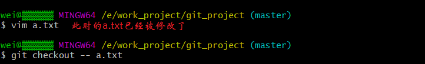
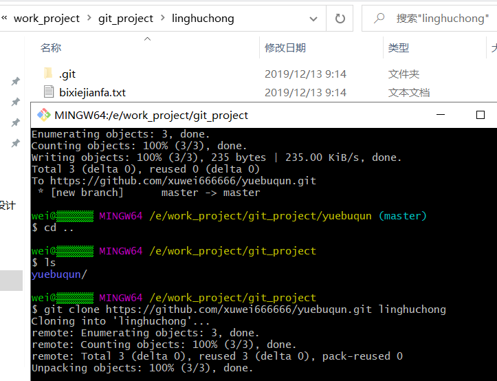
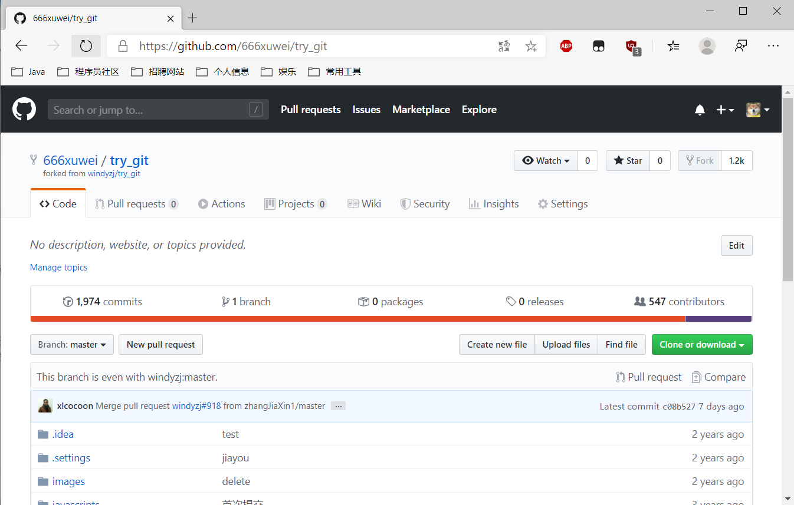

# Git 和 GitHub

## 1. 简介

Git 是目前世界上最先进的 **分布式版本控制系统** ，由 Linus Torvalds(林纳斯*托瓦兹)所开发的。

BitKeeper 是 Git 之前的版本控制系统，但是由于收费，最后被 Git 所打败。

**版本管理系统能干什么？**

协同开发，代码备份，冲突解决，历史追查，版本还原，版本记录，分支管理，代码审查，权限管理等

**分布式**

1. 将不同功能数据放到不同的机器上。 
2. 将同一数据放到不同的服务器上(数据副本)，服务器之间通过网络互通。

**集中管理型版本控制**

经典的集中管理型（CVS、VSS、SVN）

特点：

**实现了大部分开发中对版本管理的需求，结构简单，上手容易。**

**
**

**
**

## 2. Git 使用

### 2.1 第一次使用

如果是第一次使用 Git，那么需要设置用户名和邮箱作为一个标识。

--global 表示全局属性，所有的 git 项目都会共用属性。C:\Users\admin路径下的 .gitconfig 文件里面可以看到。

### 2.2 实战操练

**1. 创建版本库**

在项目文件夹内，执行 git init，比如我是在 E:\work_project 下创建了一个文件夹 git_project，进入该文件夹后，点击鼠标右键，选中 Git Bash Here，执行 git init命 令。

**2. 提交文件**

- - 在当前目录下，新建文件 a.txt，在里面添加一些内容，然后通过 git status 进行查看文件状态，此时文件还没有交给 git 去管理。

​       

- - 将文件添加到暂存区 git add 文件名。

- - 提交文件到本地库 git commit -m "第一次提交"，-m 后面写的是注释。

- - 为了方便后面演练，我需要多次 add 和 commit 文件。

**3. 查看文件提交记录**

- - 执行 git log 文件名，进行查看历史记录，HEAD 指向的是当前版本。

- - 简易信息查看：git log --pretty=oneline 文件名

**4. 回退历史**

- - 比如我想回退到上一次提交：

- - 比如我想回退 n 次操作呢：git reset --hard HEAD~n

**5. 版本穿越**

- - 进行查看历史记录的版本号，执行 git reflog 文件名

- - 此时如果向回到那个版本，直接执行：git reset --hard 版本号

**6. 还原文件**

比如我在这个版本对这个 a.txt 文件进行了大量修改，但是突然又要用没修改前的，此时就可以使用命令：git checkout -- 文件名

**7. 删除某个文件**

- - 删除这个文件
    - 再 git add 再提交，但是 **git reflog 还是可以看到历史记录。**

​    

### 2.3 实战操练---分支

**1. 创建分支**

- git branch 分支名          
- 查看分支：git branch -v  

 比如：git branch test

**2. 切换分支**

- git checkout 分支名
- 创建并切换分支：**git checkout -b 分支名**

 

**3. 合并分支**

比如我在分支 test 上增加了一条内容，再切换到主干 master 查看发现没有，此时就需要合并分支了。

① git checkout master ② git merge test 

- 

**4. 删除分支**

- 先切换到主干：git checkout master
- 删除分支：git branch -D 分支名

 

**5. 合并时冲突**

冲突：一般指的是同一个文件同一位置的代码，在两种版本合并时版本管理软件无法判断到底应该保留哪个版本，因此会提示该文件发生冲突，需要程序员来手工判断解决冲突。

比如我们自己制造冲突，在 master 分支下 a.txt 添加一行内容 "master"，添加到暂存区并提交到本地库。然后切换到另一个分支 test，在 a.txt 下添加一行内容 "text"，添加到暂存区并提交到本地库。最后切换到 master 分支后，开始合并分支，发生冲突。

此时系统会提示 **CONFLICT** 关键字，命令行后缀会进入 **MERGING** 状态，表示此时是解决冲突的状态。

**6. 解决冲突**

此时我们可以通过 git diff 可以找到发生冲突的文件及冲突的内容，然后修改冲突文件的内容，再次 git add 文件名 和 git commit 提交后，后缀 **MERGING** 消失，说明冲突解决完成。

## 3. GitHub 使用

### 3.1 GitHub 是什么

GitHub 是一个Git项目托管网站,主要提供基于 Git 的版本托管服务

### 3.2 GitHub 流程

### 3.3 GitHub实战演练

**1. 搭建代码库**

在 E:\work_project\git_project 目录下创建文件夹 yuebuqun，进行 git init 初始化，然后配置局部的用户名和邮箱。

**2. 提交代码**

接着在其文件夹中创建文件 bixiejianpu.txt，添加一行内容， `欲练此功` ，然后add，commit。

**3. GitHub 准备工作**

需要先创建 GitHub 账号，并且在 GitHub 中搭建项目，项目名与要推送的文件所在的文件夹名相同。比如此时我的文件夹名是 yuebuqun，则我在 GitHub 上创建一个叫 yuebuqun 的项目。

**4. 推送代码到远端**

第一步，使用变量来记录远端的地址：git remote add origin https://github.com/xuwei666666/yuebuqun.git

第二步，直接推送到云端，git push origin master.

注意：如果出现 403 错误，可能是 win10 的 windows 凭据上是之前的 github，将其修改或者删除。

**5. 从 GitHub 上克隆代码**

在 E:\work_project\git_project 目录下直接 clone github 上的代码，并保存在 linghuchong 这个文件夹下。

**6. linghuchong 配置**

在 linghuchong 这个文件夹下进行配置，配置局部的用户名和邮箱，然后编辑 bixiejianfa.txt，添加一行内容 `不知道`，然后 add，commit。

如果此时我将这个修改后的文件推送到云端，本来应该报403错误，但是我没有，不清楚。一般情况下需要添加项目的合作伙伴。

下面是我创建合作伙伴之后，然后将文件推送到 github 上。

**7. yuebuqun** 配置

yuebuqun 获取更新后的 github 文件，git pull origin master，查看内容已经被改变。

**8. 协作冲突**

在 yuebuqun 这边对这个 bixiejianfa 进行了修改，添加一行内容“岳不群大佬”，然后add，commit。

在 linghuchong 这边对这个 bixiejianfa 也进行了修改，添加一行内容“令狐冲小弟"，然后 add，commit。

此时如果将两个人修改的文件都推送到 github 上，谁会成功？谁先谁成功。

比如 yuebuqun 先推送到 github上，linghuchong 再推送，会报错。

怎么解决？在 linghuchong 这边先将 github 上的代码 pull 过来，然后查看冲突位置，修改冲突的文件，最后再将文件add，commit，然后将解决后的文件重新推送到 github 上。

### 3.4 GitHub 实战演练2

**需求**

当前项目已经开发一段时间了，此时需要请一个外援，但是他不能直接参与我们的项目开发，怎么办？

**解决**

比如我登录自己的 GitHub 账户，账户名为 666xuwei，然后将账户名为 xuwei666666 的项目克隆一个副本，在这个副本上进行操作。

副本克隆好之后，对这个项目 yuebuqun 进行修改，添加一行内容，"必先xxx",此时注意，提交改变的时候必须说明改变的标题及内容，这样清晰了然。

然后在当前账户，点击 New Pull Request，然后创建 Pull Request。

此时在 xuwei666666 这个账户上，就已经收到了来自 666xuwei 的推送，确认没问题后，点击合并，查看合并之后的代码。

## 4. 配置 ssh

**1. 本地生成 ssh**

首先进入到本地用户目录，使用命令：cd ~，然后查看 .ssh 文件夹是否存在，如果存在，直接删除；重新生成密钥文件，使用命令：ssh-keygen -t rsa -C yanxuwei666@163.com。

然后进入 .ssh 文件夹下，将 id_rsa.pub 文件里的内容全部复制下来。

**2. GitHub 配置**

进入 GitHub 的个人 Settings 里，进行下列配置。

**3. 开始使用**

首先我在 linghuchong 这个文件夹重新打开一个 Bash 窗口，然后生成新的变量 originssh，使用命令： git remote add originssh git@github.com:xuwei666666/yuebuqun.git。

然后可以使用了，第一次使用时，需要输入 yes。

## 5. Git 工作流

### 5.1 什么是工作流

简单来说就是，一个项目的成员们在工作中统一使用 Git 的工作方式。

### 5.2 分类

#### 5.2.1 集中式工作流

像 SVN 一样，集中式工作流以中央仓库作为项目所有修改的单点实体。所有修改都提交到 Master 这个分支上。这种方式与 SVN 的主要区别就是开发人员有本地库。

#### 5.2.2 GitFlow 工作流

Gitflow 工作流通过为功能开发、发布准备和维护设立了独立的分支，让发布迭代过程更流畅。严格的分支模型也为大型项目提供了一些非常必要的结构。

#### 5.2.3 Forking 工作流

Forking 工作流是在 GitFlow 基础上，充分利用了 Git 的 Fork 和 pull request 的功能以达到代码审核的目的。更适合安全可靠地管理大团队的开发者，而且能接受不信任贡献者的提交。

### 5.3 GitFlow 工作流详解

**分支种类** 

- 主干分支：master

- - 主要负责管理正在运行的生产环境代码。永远保持与正在运行的生产环境完全一致。

- 开发分支：develop

- - 主要负责管理正在开发过程中的代码。一般情况下应该是最新的代码。

- bug 修理分支：hotfix

- - 主要负责管理生产环境下出现的紧急修复的代码。 从主干分支分出，修理完毕并测试上线后，并回主干分支。并回后，视情况可以删除该分支。

- 准生产分支（预发布分支）： release

- - 较大的版本上线前，会从开发分支中分出准生产分支，进行最后阶段的集成测试。该版本上线后，会合并到主干分支。生产环境运行一段阶段较稳定后可以视情况删除。

- 功能分支：feature

- - 为了不影响较短周期的开发工作，一般把中长期开发模块，会从开发分支中独立出来。 开发完成后会合并到开发分支。

## 6. GitHub 学习实战

网址：https://windyzj.github.io/try_git/

- 0、点击右上角的"Give me Pull Request"
- 1、fork本项目到自己的账户
- 2、把自己账户下的项目clone到本地仓库
- 3、修改index.html的留言区增加一条学习感想，可以留下班级姓名。
- 4、修改后提交到本地库（add、commit）
- 5、推送到自己GitHub账户下的项目上
- 6、登录GitHub，在自己的项目上找到提交的分支，点击New pull request
- 7、填写pull request申请，观察自己代码是否提交正确（应该只增加一行内容）。
- 8、然后请等待项目管理员合并，如果提交的内容有问题，管理员会退回。

