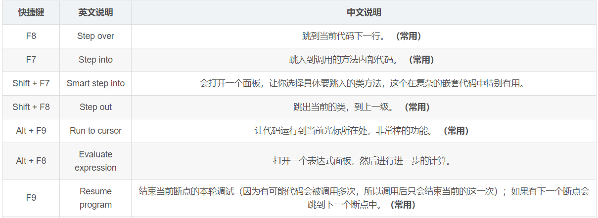

## 一、运行错误

- 出现无效的目标发行版13

## 二、IDEA 快捷键

- alt+Delete：快速查找jar包

# Idea

## 1. Idea 配置

#### 1、配置项目选择界面

file--->setting---->Appearance & Behavior --- System Settings --- reopon last project on startup 这个选项去掉勾重启即可。

#### 2、配置 Maven

#### 3、设置鼠标滚轮修改字体大小

#### 4、**设置鼠标悬浮提示**

**
**

****

**
**

#### 5、**设置自动导包功能**

**
**

****

**
**

#### 6、**设置显示行号和方法间的分隔符**

**
**

****

**
**

#### 7、**忽略大小写提示**

**
**

****

**
**

#### 8、**设置取消单行tabs的操作**

**
**

****

**
**

#### 9、**设置项目文件编码**

**
**

****

**
**

#### 10、添加自定义快捷键

1. 先添加 Template Group
2. 在组中添加方法快捷键
3. 在Template text 中添加原方法。

#### 11、设置自动编译

#### 11、设置类头信息

## 2. Idea 插件安装

#### 1、代码检查：Alibaba Cloud Toolkit

#### 2、快捷键提示：Key Promoter X

#### 3、RainBow Brackets（彩虹括号）

#### 4、自定义日志颜色：Grep console

#### 5、让 mybatis 向 java 代码一样编辑：Free Mybatis plugin

#### 6、Maven Helper

#### 7、mybatiscodehelp：强大的mybatis插件

#### 8、关闭自带的插件

...

## 3. Idea 快捷键

#### 3.1 编辑

1. Ctrl + Shift + Space 示例（智能补全）
2. Ctrl + P 示例（方法参数列表）
3. Ctrl + Q 示例（API 说明文档）
4. Alt + Insert 示例（自动生成与类相关的代码）
5. Ctrl + O 示例（该类中所有覆盖或者实现的方法列表）
6. Ctrl + Alt + T 示例（生成具有环绕性质的代码）
7. Ctrl + Shift + V 示例（剪切或拷贝的代码历史记录中，选择粘贴的内容）

#### 3.2 查找和替换

1. Ctrl + F （查找）
2. Ctrl + Shift + F （通过路径查找）

#### 3.3 编译和运行

#### 3.4 调试

#### 3.5 导航

Ctrl + N （打开类查询框）