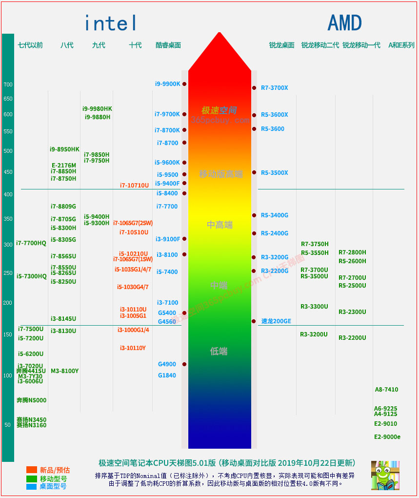

# 笔记本知识点

## 1.选取笔记本核心要素

1. CPU
2. 内存
3. 硬盘
4. 显卡
5. 屏幕
6. IO 接口

## 2. 笔记本配置的基本知识

### CPU

CPU 是笔记核心部分，CPU 的强弱决定了你网站和软件的打开速度，程序编译速度，文件解压缩速度和非线编视频剪辑渲染速度等。

CPU 目前品牌只有两个： **英特尔** 和 **AMD** 

英特尔，年年性能提升都不大，近十年只有第七代酷睿升第八代性能提升较大，其他都跟挤牙膏似的，故得名牙膏厂。目前牙膏厂占据笔记本市场主流。

AMD，外号农企，旗下的瑞龙虽然这几年在桌面端市场占有率提升很大，但是移动端并没有太多产品。移动端AMD只有低压处理器R5 3500U卖的不错，性价比很高。

CPU 目前有两个大类： **低压处理器** 和 **标压处理器** 

- 低压处理器耗电量低，续航强，但是无法长时间维持高性能，一般情况性能比标压要差一些，一般用于轻薄笔记本。

- - **低压处理器**结尾以**U**来结尾，例如i5-8250**U**，R5-3500**U**。

- 标压性能强，但是续航捉急，一般用于游戏本，高性能笔记本，移动工作站上。

- - 标压处理器英特尔一般以H为结尾（过去以QM，HQ为结尾），例如I5-8300H。另外还有以HK结尾的高端CPU，意思是不锁倍频，例如i9-8950HK，一般只有顶级发烧友或者工作站需求才会买这种。

- 高性能笔记本的CPU推荐：i5 9300H，i7-9750H或者更高
- 轻薄型笔记本的CPU推荐：i5-8250U，R5-3500U，R5-2500U（上一代锐龙，和R5-3500性能接近）
- 注意：

- - i5 9300H 比 i5 8300H 相比，基本没有提升。
    - i7的9750H倒是比上一代8750H提升了0.4GHz，同时L3缓存加到12M。
    - 新推出的 i7-9850H 实质是I9阉割出来的，目测可能是高性价比之选。

### 内存

内存决定了你能同时运行多少程序，另外绝大部分专业软件和游戏都有内存容量要求，例如战地5要求至少8G内存，你4G内存的游戏本都打不开游戏。

内存现在有DDR3和DDR4两种规格，市面上绝大部分都是DDR4的了，看到DDR3的古董就算了吧。另外内存条的频率也各不一样，2133，2400等等。这个对体验的影响不算很大，频率肯定越高越好，但是2133这种低端货一样能用。

另外，和CPU，显卡不同，大部分笔记本内存是可以加装和更换的。因此内存如果觉得不足可以自己再加一条，构成双通道内存，性能还能有所提升。

注意：大部分轻薄本，**内存是焊死在主板上的，无法更换和添加！**

**
**

**推荐：
**

- 高性能笔记本内存容量推荐：**8G起步，16G够用**
- 轻薄型笔记本内存容量推荐：**8G够用，看需求和钱包丰盈程度是否选购16G**

**
**

**
**

### 硬盘

硬盘的容量决定了你能存多少文件，硬盘的协议和接口决定了你读写文件，打开软件和进入游戏的速度。

目前硬盘有两种规格：机械硬盘（HDD）和固态硬盘（SSD），机械硬盘主流有5400转和7200转，不管哪种都够慢的。固态硬盘分类较多，按照协议分的话，有SATA协议和NVME协议。**优先选购配备大容量SSD的机型。**

**
**

**推荐：**

- 高性能笔记本推荐SSD：Nvme协议MLC或者TLC颗粒，256G以上。
- 轻薄型笔记本推荐SSD：啥都行，有就可以了。容量看个人需求和荷包丰盈程度决断

### 显卡

这一段，如果你不玩游戏或者没有图形性能需求（AE，3DMax，MAYA，CAD等等），那么没必要看，买个配集显或者MX250的本子就可以了。

移动端显卡（笔记本显示芯片）也是主要有两个品牌：Nvida，俗称N卡，和ATI，俗称A卡，笔记本显卡主流是N卡，A卡很少见。

N卡同样有几个系列：

- GTX系列：高性能游戏显示芯片，主要是给游戏玩家准备的。2019年比较常见的是**GTX1660**和**GTX1650**
- RTX系列，N卡旗舰系列，相较于GTX系列增加了光追技术支持，同时性能和规格也要强于GTX系列，例如N卡旗舰**RTX2080**，次旗舰**RTX2070**均为RTX系列。
- MX系列：低功耗显示芯片，一般用于轻薄本，发热量较低，同时由于功耗较低，延长了笔记本的续航。MX系列仅有**MX150，MX250**值得购买，其他都是性能比集显还弱鸡的鸡肋。MX150已经足够玩CSGO和LOL这一类低性能需求的游戏了。
- 部分N卡后缀有一个MAX-Q的标志（有的写作MAQ)，你可以看作是该显卡的低功耗版本，而标注MAX-P则是该显卡的完全版（啥都不标的一般都是MAX-P）。例如RTX2070就有RTX2070 MAX-Q 80W，RTX2070 MAX-Q 90W和RTX2070 115W。

- - MAX-Q这个东西之所以会出现，是因为很多品牌的游戏本or高性能本子的散热实在压不住完全版的显卡，因此Nvida不得不出一批降低了TGP（整张显示芯片功耗）来帮助厂商降低散热压力。但是，这种卡降低了TGP也意味着性能缩水，例如**RTX2080 80W版性能和RTX2070**完整版几乎一致，只有3%左右的性能差距，实际是有点坑人的。
    - 举个简单点的例子：微星旗舰笔记本GS75配备的是RTX2080 Max-Q 80W版，次旗舰笔记本GE75配备的是RTX2070，二者差价9000元，但是在显卡上的差距呢？次旗舰干掉了顶级旗舰，可喜可贺可喜可贺。

**简单点评一下常见的笔记本显卡芯片：**

GTX1050/GTX1050TI/GTX1650：

常见于4000-6000元价位游戏本，可以中低特效运行2019年的3A大作。常见网游，例如LOL，CSGO高特效足够稳定60帧。吃鸡中低特效稳定40帧左右。

GTX1060/GTX1660TI

常见于6000-9000价位游戏本，性价比最高的显示芯片系列。可中高特效60帧运行2019年的3A大作。LOL，CSGO最高特效可稳定100帧以上，吃鸡中特效可稳定60帧。不支持光锥技术，但是现在也没几个游戏支持光锥特效

RTX2060/2070/2080MAX-Q

常见于9000-15000价位，2070满血版足够最高特效60帧运行2019年的3A大作，已经没有电竞游戏能够限制住这几款显卡了。可以考虑上144Hz刷新率的电竞屏幕了，完全带的动了。

RTX2080

常见于各种带有奢侈品属性的笔记本中，价格突破天际，土豪之选。性能怪物，足够秒杀90%的台式机显卡了。已经没有几个游戏能阻止2080开最高特效了。

### 屏幕

目前笔记本屏幕主流材料有三种：IPS，VA，TN

- IPS就是俗称的硬屏，苹果手机4系列就是用的这种屏幕，优势是可视角度好，色彩饱满；缺陷是延迟高，响应慢。
- TN就是俗称的软屏，优点是，响应时间极快，延迟低；缺陷是可视角度不佳，屏幕发白。
- VA：优势是对比度高，缺陷是延迟高。

绝大部分笔记本屏幕都是45% NTSC，也就是所谓的瞎眼屏。这种屏幕没啥好说的，降低成本的存在。

但凡是宣称sRGB大于95%的，屏幕素质都算不错了。

### IO 接口

**USB**：3.0已经相当普遍，现在买笔记本可以有2.0的，但必须有3.0的。注意数量，3到4个比较常见，按照自己常用USB设备的数量取舍。如果4个都不够，忽略这条，买个Hub吧；**RJ45**：网线插口，有的超极本为了轻薄取消，需用USB转接。

### 几个购机 Tips

- **强烈不建议实体店**
- **不建议托熟人购买**
- **信息获取途径**：查找**中关村**在线、天猫、京东**介绍页面**，淘宝，天猫，京东的**评价里的图片**，咨询天猫、京东的**客服**，笔记本吧、显卡吧**精品贴、测评贴**。**不建议直接百度**，不懂瞎BB的太多。
- **推荐网购**，建议选择有信誉的平台，如京东，天猫旗舰店等。

## 3. 计划买笔记本

**需求** ：

最少 8 G(可加) + 512 G，cpui7高端

**目前看中笔记本** 